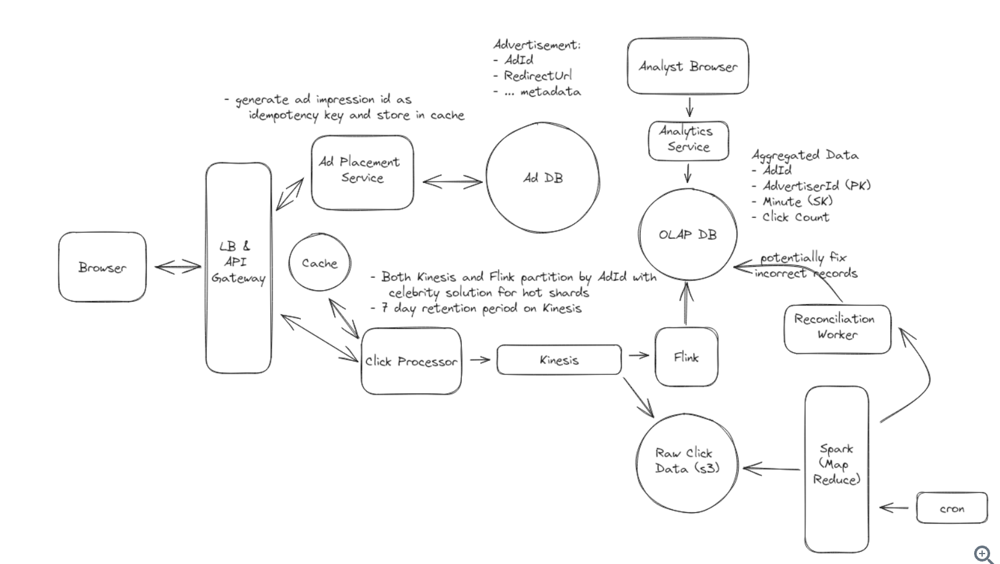

[Ref](https://www.hellointerview.com/learn/system-design/answer-keys/ad-click-aggregator)

1. Functional Requirements
   1. click the ad and redirect to the url
   2. query and click metrics over time
   3. (optional) ad targeting
   4. (optional) cross device tracking
2. Non-Functional Requirements
   1. Scalable
   2. Low latency
   3. Fault tolerant and accurate data collection
   4. Idempotent click tracking
   5. (optional) Fraud and spam detection
   6. (optional) converstion tracking
3. Core Entity
   1. user
   2. click
4. API
   1. input : click
   2. output: click metrics
5. High-level Design
   1. User click on Ads and be redirected to the target
      1. Do redirect on server side which can provide a consistent experience and allow to append additional parameters.
   2. Advertisers can query click metrics each 1 min interval
      1. Stream processing -> to address latency and scalability issue. We can write event to a stream like kafka, and use a stream processor like Spark Streaming to read the events. When reach the end of a time window, we can flush the aggregated data to the OLAP database.
6. Deep Dive
   1. How scale to support 10k clicks per second?
      1. Click processor service : we can easily scale service horizontally by adding more instances. Also add a load balancer to distribute load across instances.
      2. Stream: Both Kafka and Kinesis are distributed can handle large number of events, but need to be properly configured. We also need to add some sharding. Sharding by Ad id is a natural choice.
      3. Stream Processor: like Spark, can also be scaled horizontally by adding more tasks. We can have a seperate job reading from each shard doing the aggregation.
      4. OLAP Database: can also be scaled horizontally by adding more nodes. While we could shard by Ad id, we may also consider sharding by Adverstiser Id. Of course, it's important to monitor db and query performance to adapte the sharding strategy.
      5. [Hot Shard Issue](../Data-Partition.md#relieve-hot-spots): To resolve it, we need a way of further partitioning the data. One popular approach is to update the partition key by appending a random number to the Ad Id like AdId:0-N 
   2. How to ensure no click data lost?
      1. We already use Kafka or Kinesis to store the click data, these streams are distributed, fault-tolerant and highly available. They replicate data across multi nodes and data centers, so event a node goes down, data is not lost. They also allow us to enable persistent storage, so even data is consumed by stream processor, it is still stored in the stream for a certain period of time.
      2. Stream processor like Flink also have a feature called checkpointing. If it goes down, it can read the last checkpoint and resume processing. This is particularly useful when the aggregation window are large, like a day and week.
      3. Reconciliation: Click data matters. If we lose data, we lose money. But it's a tough balance because guarantee correctness and low latency are often conflict. We can balance the two by introducing periodic reconciliation which could be a job that runs every hour or day.
         1. At the end of stream, alongside the stream processor, we can also dump the events to a data lake like S3. When Advertisers query click metrics, we can run a batch job that read all click events from the data lake and re-aggregates them. This way, we can compare the results of the batch job to the results of the stream processor and ensure they match.
   3. How to prevent abuse from users clicking multiple times
      1. generate a unqiue impression ID for each ad instance shown to the user.
   4. How to ensure Advertisers can query at low latency?
      1. this was largely solved by the pre-processing data in real time. With real-time stream processing, the data is already aggregated and stored in the OLAP database making the query fast.
      2. Where the query can still be slow is when we aggreagate over large time windows. In this case, we can pre-aggregate the data in db. This can be via a daily cron job runs to aggregate the data and store it in the new table.
7. Diagram
