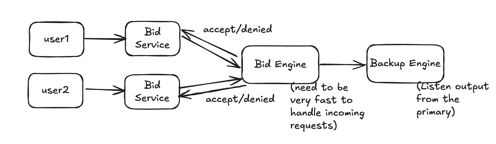

[Ref](https://www.youtube.com/watch?v=3aX-lC5_P1M)

1. Functional Requirements
   1. Bidders is able to register, browse, place bids, receive notification and track auctions
   2. Sellers is able to list items and price
   3. Auctions can have fixed end time or variable one depending on time of last bid
   4. Users should get price updates in real time
   5. Admin is able to manager users, auctions, bids
   6. Analytics and Reporting
2. Non-Functional Requirements
   1. Scalability - 20M DAU
   2. Low latency
   3. Consistency for bid
   4. Availability for service
3. Capacity Estimation
   1. Buyers : 100M, Sellers: 1M, Item listed: 5M, DAU: 20M
   2. Request per sec: 23K RPS
   3. Storage
   4. QPS
4. Core Entity
   1. Bid: bidId, auctionId, userId, price, createdAt, status
      1. We will eventually want all bids per auction for auditing purpose -> Put in time series database sharded by auctionId
   2. Auction: auctionId, currentBidId, price, endTime
5. API
   1. add new item for auction
   ```
   POST /auction
   {userId, itemCategory, totalQuantity, description}
   ```
   2. bid the item
   ```
   POST /bid
   {userId, itemId, maxBid}
   ```
6. High-level Design
   1. Bid Service
      1. Option 1: all bids go into Kafka, ordered by log, sharded by auctionId.   
      `Client -> Kafka -> Bid Service (determine if bid is accepted or rejected)`  
      Pros: High Kafka write throughput  
      Cons: User is notified their own status asynchronously, could be delayed.  
      2. We need a Synchronous Bids for the sake of our user experience. Option 1 is not feasible since it uses streaming processing.
      
    2. Bid Engine: 
       1. It only takes 32 bytes to store the state of each auction, we can keep this in memory (no disk reads, no network calls to database)
       2. As each request comes in, lock auction state, compare bids and proceed
       3. If these engines are getting a lot of traffic, we can partition them. 
          1. All bids with same auctionId on same engine
          2. Consistent Hashing on auctionId
       4. How do we ensure fault tolerance of the bid engine as we store everything in memory?
          1. We need a backup in case the primary goes down. If we send bids to the primary and the backup, they may disagree on the order of the bids
          2. The backup should listen to output from the primary. Each bid has a sequence 
          
    3. When a bid is handled, many parties like
       1. Backup bidding engine
       2. Audit database
       3. Other users  
       We can put them in Kafka so multiple consumers can subscribe
    4. Kafka: fault tolerance. We publish to Kafka before telling user if their bid was accepted
       1. This prevents rist of bid engine failing before data published to Kafka
       2. We still have rist if kafka goes down -> The more safe we are with replication, the slower writes are for the user.
    5. Audit Consumer -> Timeseries DB
    6. User Server -> (SSE) -> user
7. Deep Dive
    1. Popular Auctions: can have thousands of users watching! may be too much load to consume all bids and send to all users
       1. Can have multiple servers connecting for users
       2. Only need to consume current auction state, not all bids
8. Diagram

