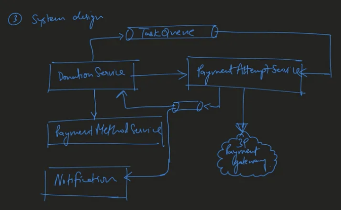

Problem:  
Say if DoorDash along with other partners across US is sponsoring for 3-day charity event where huge partipation of more than 3 million customers are expected to participare and simply donate money. You were responsible to design an app for this. How would you go about it?

Your app simply accept certain details like customer name, email address, credit/payment method details. You can assume DoorDash already has partned with payment gateway to store the money collected from event, and trasfer them back later.

1. Funtional Requirements
   1. 3 day donation, 3 million users
   2. ? user login
   3. ? donation history
   4. ? user experience
2. Non Functional Requirements
   1. 3 million donation over 3 days -> 10 RPS (request per second) -> 100 RPS in the spike
   2. HA
   3. low latency
   4. consistency
3. Data Model
   1. User : userId, name, email
   2. Payment: pid, userId, status, last4
   3. Donation: did, userId, amount, concurrency, status
   4. PaymentAttempt: attempId, donationId, paymentId, status
4. High-level Design
   1. 
5. Some extension
   1. how to scale?