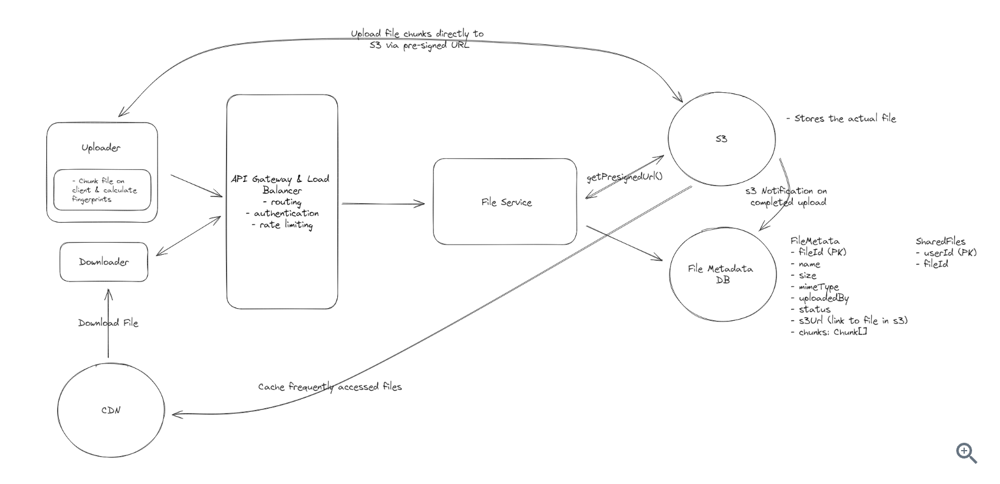

[Ref](https://www.hellointerview.com/learn/system-design/answer-keys/dropbox)

1. Functional Requirements
   1. upload files
   2. download files
   3. share files with other
   4. sync files
   5. (optional) edit files
   6. (optional) view files without downloading
2. Non-Functional Requirements
   1. HA
   2. support larget files (50GB)
   3. low latency
   4. secure and reliable
   5. (optional) storage limit
   6. (optional) file versioning
   7. (optional) scan files for viruses and malware
3. Core Entity
   1. File
   2. FileMetadata
   3. User
4. API
   1. upload file
   ```
   POST /files
   {File, FileMetadata}
   ```
   2. download file
   ```
   GET /files/{fileId} -> File/FileMetadata
   ```
   3. share files
   ```
   POST /files/{fileId}/share
   {User[]}
   ```
5. High-level Design
   1. upload file
      1. How to store file metedata : can use NoSQL db like DynamoDB (loosely structured, few relations)
      2. How to store file contents : can use Blob storage. Allow user to upload file directly to Blob Storage. (like S3 has presigned URL)
   2. download file
      1. use presigned URL and CDN. CDN is to cache file closer to the user, reduce latency and speed up download times.
   3. share file
      1. create a separate tables for shares. userId(PK) and fileId(SK) - fileId is the file which is shared by the given user.
   4. sync file
      1. Local -> Remote
         1. need a client-side sync agent to monitor the file change
      2. Remote -> Local
         1. Polling: simple but can be slow to detch changes and waste bandwidth if nothing changed
         2. WebSocket or SSE: complex but provide real time updates.
         3. (Best) Hybrid: for files have been recently edited, use WebSocket; for files haven't been modified for a while, use periodic polling
6. Deep Dive
   1. How to support large files
      1. POST limition: timeout/Browser and Service Limitation / Network interruption / User Experience
      2. Need to be addressed : Progress Indicator && Resumable Uploads
      3. Solution: chunking - break file into smaller pieces and upload them in parallel. Don't chunk the file on the server which will be slow. We also need to track all chunks status inside FileMetadata/chunks field.
      4. How to make sure chunks is in sync with the actual chunks have been uploaded? - Once S3 uploaded file successfully, it send a event notification to server to update the chunk status.
   2. How to make sure all actions as fast as possible?
      1. CDN cache
      2. chunking
      3. only sync changed files instead of the whole file
      4. compression (need to consider compress and decompress time tradeoff, like text has high compression ration, but image and video are not.)
   3. How to ensure file security
      1. Encryption in Transit : HTTPS
      2. Encryption at Rest (encrypt files in S3)
      3. Access Control
      4. share link set expiration time
7. Diagram
