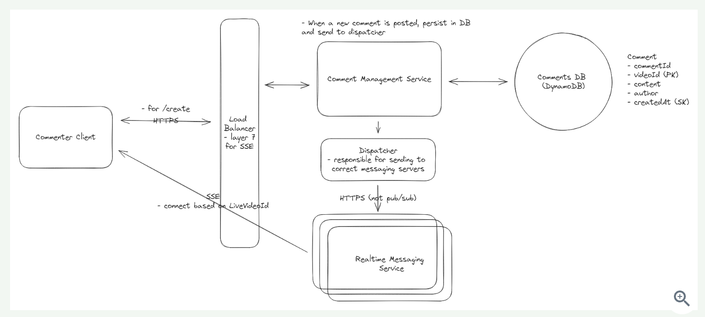
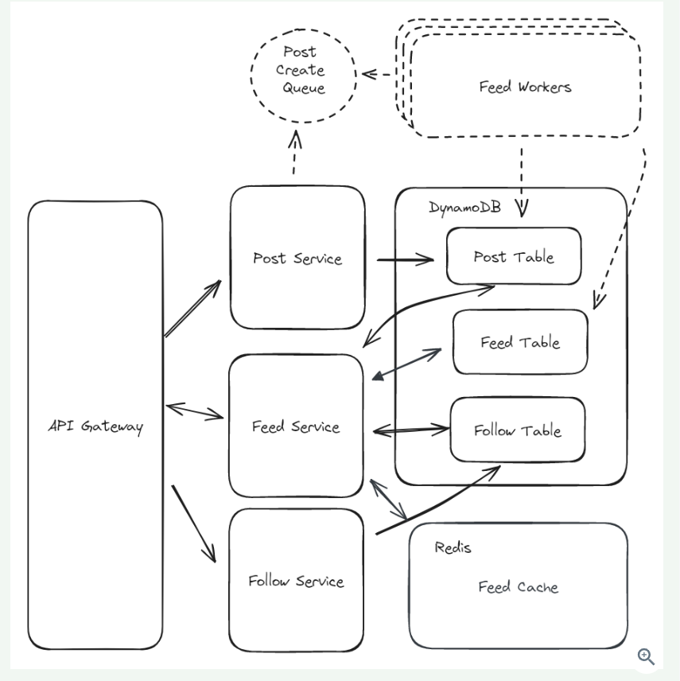
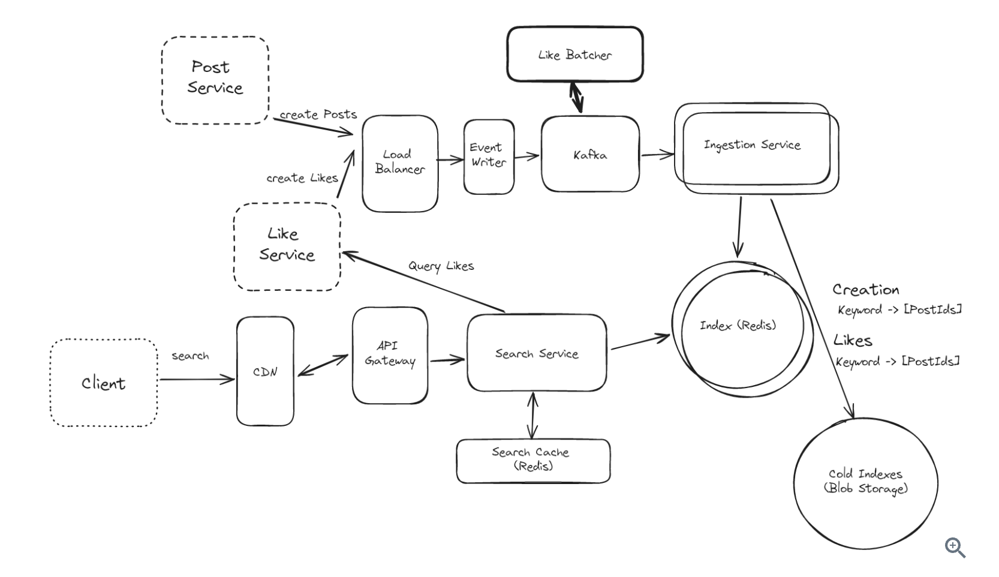

[Ref-LiveComments](https://www.hellointerview.com/learn/system-design/problem-breakdowns/fb-live-comments)  
[Ref-NewFeeds](https://www.hellointerview.com/learn/system-design/problem-breakdowns/fb-news-feed)  
[Ref-PostSearch](https://www.hellointerview.com/learn/system-design/problem-breakdowns/fb-post-search)  

# Live Comments
1. Functional Requirements
   1. post comment
   2. view comments near real-time
   3. view previous comments
   4. (optional) reply to comments
   5. (optional) react to comments
2. Non-Functional Requirements
   1. scalable - support millions concurrent views and thousands of comment per second
   2. high availability, eventual consistency is fine
   3. low latency, near real-time
   4. (optional) secure: authorized user, appropriate comment
3. Core Entity
   1. User
   2. Live Video
   3. Comment
4. API
   1. post a comment
   ```
   POST /comment/create
   {videoId, message}
   ```
   2. fetch comments
   ```
   GET /comment/:videoId
   -> Comment[]
   ```
5. High-level Design
   1. post comment: client -> LB -> CommentManagementService -> DB
   2. see all comments
      1. Websocket : not suitable our case which read/write ratio is not balanced
      2. SSE (undirectional and goes over HTTP): better when read > write. The infrequent writes goes over HTTPS and the frequent reads are served by SSE. -> Chanllenge: it maintain a persistent connection which may disrupt the continuous stream data
   3. see previous comments made before they joined, know as "Infinite scrolling"
      1. Cursor Pagination with Prefetching and Caching
         1. Cursor Pagination : `GET /comments/:liveVideoId?cursor={last_comment_id}&pagesize=10`
         2. system also prefetch a larger set of results and stores them in a cache. -> Challenge is enaure cache stay synchronized with the latest data
6. Deep Dives
   1. How to support millions of concurrent views?
      1. We already land on SSE technology. With SSE, we need to maintain an open connection for each viewer, and each connection will occupy a port. For a server, the maximum available port is 65535. To suport millions viewers, we need to scale horizontally. But then how do we distribute load and how does each server know which comments to send to which viewer?
         1. while traditional port limit is around 65535. Advanced techniques like port reuse and enhanced TCP/IP stack implementation (TCP port multiplexing and HTTP/2 enable) allow single port to handle multiple connections.
         2. To address the issue of servers handling viewers watching many different live videos, we can implement a more intelligent allocation strategy. This strategy would ensure that servers primarily handle viewers watching the same video. To do this, we'll upgrade our load balancer to a layer 7 load balancer that can route traffic based on the live video ID. This will ensure that viewers watching the same live video are routed to the same server.
         3. Pub-sub partition: server only need to subscribe the topic for the small number of live videos. -> Challenge: the uneven distribution load, which need dynamic resource allocation strategy, such as spinning up additional server ore reallocating resources.
         4. Scalable Dispatcher instead of PubSub: We need to introduce a new component called a Dispatcher Service. The dispatcher service is responsible for receiving comments from the comment management service and sending them to the correct Realtime Messaging Server. To achieve this, the Dispatcher Service maintains a dynamic mapping of viewers to their corresponding Realtime Messaging Servers. This mapping is constantly updated in response to viewer activities, such as joining or leaving a live video stream. When a new Realtime Messaging Server comes online, it registers itself with the Dispatcher Service, updating the Dispatcher’s understanding of the system's current topology. This registration process includes information about the server's capacity and the live videos it is currently serving. The Dispatcher Service is also designed to be scalable and replicable. In high-demand scenarios, multiple instances of the Dispatcher Service can be deployed to share the load. This replication not only balances the traffic but also adds redundancy to the system, enhancing its resilience.
7. Diagram



# News Feed
1. Functional Requirements
   1. create post
   2. follow people
   3. view a feed in chronological order
   4. page through their feed
   5. (optional) like and comment the post
   6. (optional) have restricted visibility
2. Non-Funtional Requirements
   1. HA
   2. low latency
   3. handle massive number of users
   4. able to follow unlimited users
3. Core Entity
   1. User
   2. Follow
   3. Post
4. API
   1. create post
   ```
   POST /post/create
   {content} -> postId
   ```
   2. follow people
   ```
   POST /user/{id}/follow
   ```
   3. get feed
   ```
   GET /feed
   -> Post[]
   ```
5. High-level Design
   1. API gateway -> Post Service -> Post DB
   2. API gateway -> Follow Service -> Follow DB
   3. API gateway -> Feed Service -> Post & Follow DB
6. Deep Dive
   1. How to handle users who are following a large number of users?
      1. in this case, the query to the Follow table will take a while and build feed. This problem is known as "Fan-out" - a single requests fans out to create many more requests. -> The instinct way is we should compute feed on write action rather than the read time -> we can have a precomputed Feed table which is just a list of postIds, stored in chronological order, and limited to a small number. -> Challenge would be write.
   2. How to handle users with a large number of followers?
      1. It's a simliar fanout problem when we create a post : we need to write to millions of Feed records. We can use Async workers with Hybrid Feeds.
         1. Async workers: we can queue up write requests and have a fleet of workers consume these requests and update feeds. Each worker will look up all the followers and prepend the post to the feed entry. -> Some worker might do a lot of work while others are only writing a few. Instead of just write a postId and UserId in the event, we could also include a partition of followers so that we can split the work across many workers.
         2. Hybrid Feeds: we can choose which account we'd like to pre-calculate and which we do not. For celebrity, instead of writing to 100 million followers we can instead add a flag to the Follow table which indicates this particular follow isn't precomputed. In the async worker queue, we will ignore these requests. Once user read, we can merge precomputed feed with recent posts from those celebrity.
   3. How to handle uneven reads of posts?
      1. For the vast majority of posts, they will be read for a few days and never read again. For some celebrity, the read of post in the first few hours will be massive.
      2. We can use cache for posts and set a TTL -> Challenge: hot shard issue
7. Diagram


# Post Search
1. Functional Requirements
   1. create and like posts
   2. search post by keyword
   3. sort search results by recency or like count
   4. (optional) support fuzzy matching on terms
   5. (optional) privacy rules and filters
   6. (optional) ranking
   7. (optional) image and media
   8. (optional) realtime updates
2. Non-Functional Requirements
   1. fast query time
   2. support a high volume of requests
   3. new posts must be searchable in 1 min
   4. HA
3. Scale Estimations
   1. 1B users
   2. post created: 10k posts/sec
   3. likes created: 100k likes/ sec
   4. searchs: 10k search / sec
   5. searchable post: 1B posts/day * 365 * 10 years = 3.6T posts
   6. raw size : 3.6T * 1kb/post = 3.6 PB
4. Core Entity
   1. User
   2. Post
   3. Like
5. API
   1. search `GET /search?query={QUERY}&sort_order=LIKES|TIME`
   2. create post `POST /post`
   3. like a post `POST /post/{id}/like`
6. High-level Design
   1. PostService / LikeService -> LB -> Ingestion Service <-> Index
   2. Client -> API Gateway -> Search Service -> Index : Create an Inverted Index (which we can create a dictionary that maps keywords to the documentId). Here we can create a map from keywords to posts. -> Challenge: postIds are going to get very large, especially for common keywords. Also there would be many keys for every post, we need to handle this scaling part.
   3. Search results by recency or like count : we can use multiple indexs, one sorted by creation time and one sorted by like count. Use redis to store these index.
7. Deep Dive
   1. How to handle large volume of requests from users? : our in-memory reverse-index based system is quite fast, but we are going to handle a lot of traffic. we can use a CDN to cache at the edge. -> Most CDNs operate like a big set of geographically-spread HTTP caches. We can append `cache-control` headers to our `/search` endpoint and tell CDN when and how long to cache a result
   2. How to handle multi-keyword, phrase queries? 
      1. Intersection and Filter : get Taylor and Swify result and intersect them. But this would be slow.
      2. Bigrams and Shingles: The idea is simple: in this sentence:  
        "I saw Taylor Swift at the concert"  
        We can create tokens for each pair of words:  
        "I saw"  
        "saw Taylor"  
        "Taylor Swift"  
        "Swift at"  
        "at the"  
        "the concert"    
        These can be inserted into our "Likes" and "Creation" indexes. When we want to search for "Taylor Swift", instead of grabbing "Taylor" and "Swift", then intersecting the results, we can go straight to the "Taylor Swift" entry and grab the relevant postIds directly.  
        The biggest problem with this approach is that it dramatically increases the size of our indexes.  
    3. How to address the large volume of writes?
       1. Post creation: when post is created and a post has 100 words, we need to trigger 100+ writes. If a lots of posts are created simultaneously, our ingestion service might get overwhelmed. -> We can partition the incoming requests. By using stream like Kakfa, we can fan out the creation requests to multi ingestion instances and partition the load. We can also buffer requests. Finally, we can scale out our index by sharding the indexes by keyword. This way writes to the indexes are spread across many indexs.
       2. Like Event: like counts would be far larger than post creations. We can involve a Two stage architecture. First, we can write to the index with only specific milestones like powers of 2 or 10. This reduces the number of writes exponentially. Instead of 1000 writes for 1000 likes, we only need 10.
    4. How to optimize storage of our system? This system is indexing an impressive amount of data, but our users are likely only interested in a vanishingly small portion of it. How can we optimize storage?
       1. First, we can put caps and limits on each of our inverted indexes. We probably won't need all 10M posts with "Mark" contained somewhere in their contents. By keeping our indexes to 1k-10k items, we can reduce the necessary storage by orders of magnitude.
       2. Next, most keywords won't be searched often or even at all. Based on our search analytics, we can run a batch job to move rarely used keywords to a less frequently accessed but ultimately cheaper storage. One way to do this is to move these keyword indexes to cold, blob storage like S3 or R2.
       3. On a regular basis we'll determine which keywords were rarely (or not at all) accessed in the past month. We'll move these indexes from our in-memory Redis instance to a blob in our blob storage. When the index needs to be queried, we'll first try to query Redis. If we don't get our keyword there, we can query the index from our blob storage with a small latency penalty.
8. Diagram
