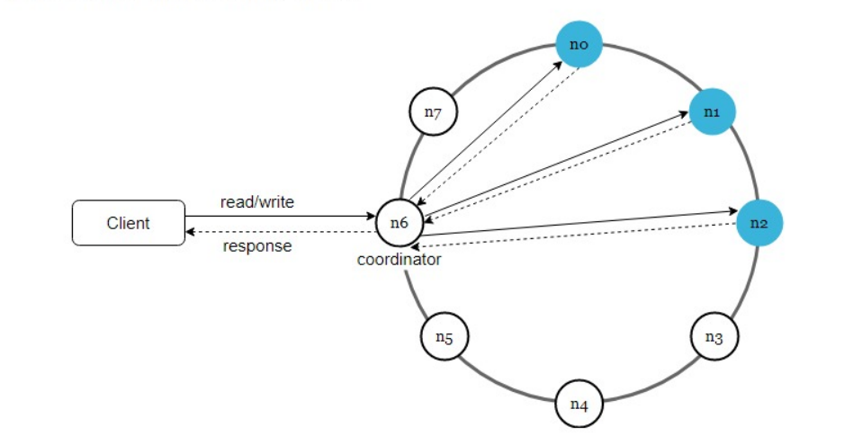
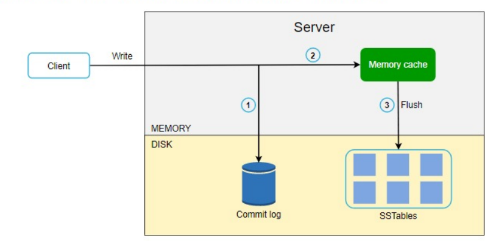
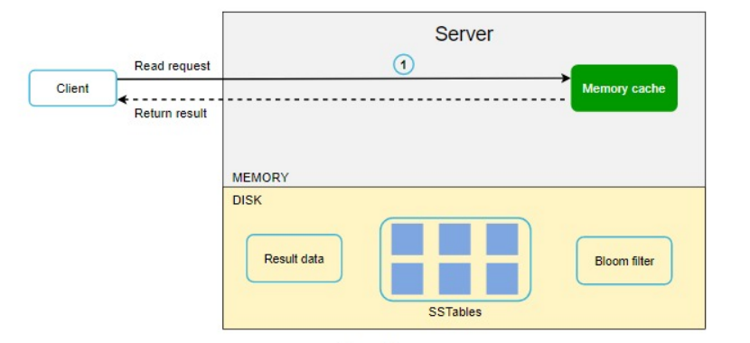
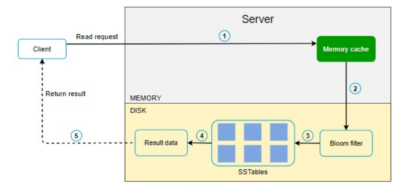

- [System Design - Key Value Store](#system-design---key-value-store)
- [System Design - Dynamo](#system-design---dynamo)

# System Design - Key Value Store
Ref : System Design Interview - An Insider's Guide_ Volume 2  

There's no perfect design. Each design achieves a specific balance regrading the tradeoffs of the read, write and memory usage. Another tradeoff has to be made was between consistency and avaiability.

1. Requirements
   1. The size of key-value pair is small : less than 10kb
   2. ability to store big data
   3. High Availability: The system response quickly, even during failures
   4. High scalability: The system can be scaled to support large data set
   5. Automatica scaling: The addition/deletion of servers should be automatic based on traffic
   6. Tunable consistency
   7. Low latency
2. Single server key-value store
   1. Two optimizations can be done to fit more data in a single server:
      1. Data compression
      2. Store only frequently used data in memory and the rest on disk
3. Distributed key-value store
   1. [CAP theorem](../SystemDesign.md#cap-theorem)
4. Core components:
   1. Data parition
      1. Two challenge : distribute data evenly & minimize data movement -> use Consistent Hashing & Virtual Nodes to resolve.
   2. Data replication
   3. Consistency
      1. Quorum consensus can gurarantee consistency for both read and write operations.
         1. R=1 and W=N: fast read
         2. R=N and W=1, fast write
         3. W+R > N: strong consistency is guaranteed
         4. W+R <= N: strong consistency is not guaranteed
   4. Inconsistency resolution : versioning
      1. Replication gives high availability but causes inconsistencies among replicas. Versioning and vector locks are used to solve inconsistency problems.
      2. Eevn though vector clocks can resolve conflicts, there are two downside: a. add complexity b. version pair can grow rapidly
   5. Handling failures
      1. Failure detection: Gossip protocol
      2. Handling temproray failures: sloppy quorum & hinted handoff
      3. Handling permanent failures: anti-entropy protocol to keep replicas in sync (Merkle tree)
      4. Handling data center outage
   6. System architecture diagram
      1. 
      2. Main features are listed as follows:
         1. Clients communicate with the key-value store through simple APIs: get(key) and put(key, value)
         2. A coordinator is a node that acts as as proxy between the client and the key-value store
         3. Nodes are distributed on a ring using consistent hashing
         4. The system is completely decentralized so adding and moving nodes can be automatic
         5. Data is replicated at multiple nodes
         6. There's no single point of failures as every node has the same set of responsibilies.
      3. Each node performs many tasks as follows:
         1. Client API
         2. Confilct resolution
         3. Replication
         4. Failure detection
         5. Failure repair mechanism
         6. Storage engine
   7. Write path
      1. 
   8. Read path
      1. 
         1. After a read request is directed to a specific node, it first check if data is in memory cache. If so, the data is returned to the client
      2. 
         1. If the data is not in memoryy, it will be retrieved from the disk instead. We need an efficient way to find out which SSTable contains the key. *Bloom* filter is commonly used to solve this problem.
   9. Summary  
      1.  | Goal/Problems	| Technique 
			| -------|------------
			| Ability to store big data | Use consistent hashing to spread load across servers
			| High availability reads | Data replication; Mutl-datacenter setup
			| High availability writes | Versioning and conflict resolution with vector clocks
			| Dataset parition | Consistent Hashing
			| Incremental scalability | Consistent Hashing
			| Heterogeneity | Consistent Hashing
			| Tunable consistency | Quorum consensus
			| Handling temporary failures | Sloppy quorum and hinted handoff
			| Handling permanent failures | Merkle tree
			| Handling data center outage | Cross-datacenter replication

# System Design - Dynamo

key-value store (HA, Scalable, decentralized, eventual consistency)
(dynamo1.png)

API: get(key), put(key, value)
key and value are an arbitrary array of bytes (MD5 hashing for key)

High-level Arch:
1. Data distribution
	consistent hashing to distribute data among nodes.
2. Data replication and consistency
3. Handling temporary failures
	? To handle temporary failures, Dynamo replicates data to a sloppy quorum of other nodes in the system instead of a strict majority quorum.
4. Inner node communication and failure detection
	? gossip protocol to track state
5. High Availability
	? keep always available by using hinted handoff
6. Conflict resolution and handle permanent failure
	? Use vector clocks to keep track of value history and reconcile divergent histories at read time.
	?In the background, dynamo uses an anti-entropy mechanism like Merkle trees to handle permanent failures.
Low-level component:
1. Data partition
? how to know which node store a particular data
? how data move when add/delete node
? how to minimize data movement
	a. a suitable hash function map key to a number, then find the server by applying modulo on this number -> when add/remove node, need to remap all keys, which would be a mess!
	b. consistent hashing, ensure only a small set of key move when add/remove node: a ring which have multi section, each section is a range of hash -> cons: add/remove node might cause overhead, some node might become hotspots, node rebuilding -> solution: Vnodes (dynamo2.png) -> which can help to spread the load more evenly

2. Data replication
sloppy quorum (dynamo3.png)
hinted handoff: when a node is unreachable, another node can accept writes on its behalf

3. Vector Clocks and Conflicting Data
Sloppy quorum can cause multiple conflicting values against the same key can exist in the system and must be resolved somehow.
clock skew issue -> can use synchronizing clocks, like NTP, but it stil do not guarantee every clock is synchronized at all times.
vector clock is used to capture causality bewteen different versions of the same object. A vector clock is a pair(node, counter) (dynamo4.png)

4. CRDT (Conflict-free replicated data types)
	⁃	It is a data structure that allow multiple users to update the same data simultaneously without conflict
5. Last write wins (LWW), based on the wall-clock timestamp

6. put() and get() operation
? how to choose a node for request
a. client can route their requests through a load balancer
	helpes scalability and makes arch loosely coupled.
	but LB cannot guarantee the node is part of perference list, which will result a more forward operation.
b. client can use a partition-aware client library that route request to the coordinator node.
	helps achieveing low latency, client can directly contact the node 
	but in this case, dynamo doesn’t have much control over load distribution and request handling.

‘put()’ process #Dynamo’s put() request will go through the following steps:
	1	The coordinator generates a new data version and vector clock component. 
	2	Saves new data locally. 
	3	Sends the write request to N − 1 highest-ranked healthy nodes from the preference list. 
	4	The put() operation is considered successful after receiving W − 1 confirmation. 

‘get()’ process #
Dynamo’s get() request will go through the following steps:
	1	The coordinator requests the data version from N − 1 highest-ranked healthy nodes from the preference list. 
	2	Waits until R − 1 replies. 
	3	Coordinator handles causal data versions through a vector clock. 
	4	Returns all relevant data versions to the caller. 

Anti-entropy through Merkle Trees
Vertor clocks can remove conflicts while serving read requests. But if a replica falls significantly behind others, it might take a very long time to resolve the conflicts using just vector clocks. To do this, we need to quickly compare two copies of a range of data residing on different replicas and figure out which parts are different.
Dynamo use Merkle trees to compare replicas of a range. (dynamo5.png)

Gossip protocol - to track cluster state
every second, each node exchange information with one randomly selected server.
every second, each node exchange information with all nodes it knows about.
But this can result in a logical partition of the cluster in a particular scenario. We can involve seeds nodes (are fully functional nodes and all nodes are aware of seeds nodes).

