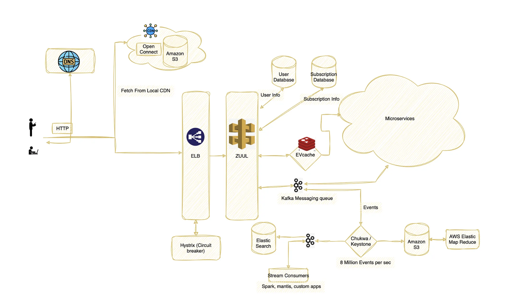

[Ref](https://www.geeksforgeeks.org/system-design-netflix-a-complete-architecture/)
[Ref](https://www.youtube.com/watch?v=VvZf7lISfgs)  

1. Functional Requirements
   1. create account, log in and out
   2. subscription
   3. stream vidoes and share, play, pause, rewind, and fast-forwarded
      1. Need to support different devices and network speeds
   4. Download for offline viewing
   5. personalized content recommendation based on user experience and viewing history
   6. upload
   7. search
   8. comment
2. Non-Functional Requirements
   1. Low latency and High responsiveness during content playback
   2. Scalability to handle large amount users
   3. High Availability
   4. Secure user authentication and authorization
   5. Intuitive user interface
3. Estimate
   1. Daily active users: 200 million, total user 1B
   2. Request per sec: 12k/s
   3. Storage per day : 5PB
   4. Bandwidth : 58GB / s
4. Core Entity
   1. User(userId, name, email, createdAt)
   2. Video (videoId, tiltle, description, url)
   3. Video Metadata
   4. Views (userId, videoId, offset, platform, createdAt)
5. API
   1. upload video
   2. stream video
   3. search video
6. High-level Design
   1. User Service
   2. Video Processing Service
      1. Video Chunker -> Content Filter -> Transcoder -> Quality Conversion -> Blob Storage (S3)
      2. Video Chunker - to support switching between multiple resolutions/encodings.
         1. Pros: parallel upload, lower barrier to starting video, grab next chunks based on current networking abilities (we need a table to keep track of chunks)
      3. We can use  Message Queue to decouple video processing pipeline from the uploads functionality.
   3. Streaming Service
      1. Open Connect, work with Internet Service providers to localize their traffic and deliver their content more efficiently.
      2. we can use Adaptive bitrate streaming protocols such as HTTP Live Streaming (HLS) which is designed for reliability and it dynamically adapts to network conditions by optimizing playback for the available speed of the connections.
   4. Search Service
   5. Analytics Service
7. Deep Dives
   1. How to onboard a movie/video? Netflix receives very high-quality videos and content from producers, and do some preprocessing.
      1. It support more than 2k devices and each one of them requires different resolutions and formats
      2. It performs transcoding or encoding, which convert original video into different formats and resolutions, even for different network speeds.
      3. Netflix breaks the original video into different smaller chunks and process these chunkis using parallel workers.
   2. How to balance the high traffic load?
      1. Elastic Load Balancer(ELB) is responsible for routing the traffic to front-end services. It performs a two-tier load-balancing schema. The first-tier consists of basic DNS-based Round Robin Balancing across zones. And the second-tier distribute the request across instances that are in the same zone.
      2. ZUUL is a gateway service that provides dynamic routing, monitoring, resiliency, and security. It provides easy routing based on query parameters, URL, and path. 
      3. Hystrix: In a complex distributed system a server may rely on the response of another server. Dependencies among these servers can create latency and the entire system may stop working if one of the servers will inevitably fail at some point. To solve this problem we can isolate the host application from these external failures.
      4. EV Cache: reduces the load from the original server. - data is shared across the cluster within the same zone and multi copies of caches are stored in sharded node. - write happens in all nodes, but read happens, it is only sent to the nearest cluster and node - if a node is down, then read from another one.
   3. Data Processing in Netflix Using Kafka And Apache Chukwa. - Apache Chukwe is an open-source data collection system for collecting logs or events from a distributed system. - Kafka is responsible for moving data from fronting Kafka to various sinks: S3, Elasticsearch, and secondary Kafka.
   4. Elastic Search: Netflix is using elastic search for data visualization, customer support, and for some error detection in the system.
   5. Apache Spark For Movie Recommendation
   6. MySQL for billing information, user information and transaction information as it needs ACID compliance.
   7. NoSQL for viewing history: Netflix divided the data into two parts:
      1. Live Viewing History (LiveVH):This section included the small number of recent viewing historical data of users with frequent updates. The data is frequently used for the ETL jobs and stored in uncompressed form.
      2. Compressed Viewing History (CompressedVH): A large amount of older viewing records with rare updates is categorized in this section. The data is stored in a single column per row key, also in compressed form to reduce the storage footprint.
8. Diagram
