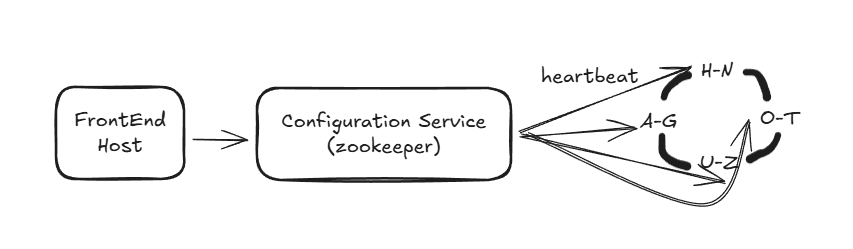
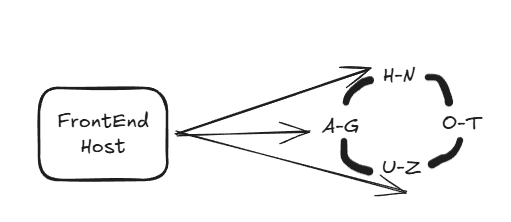
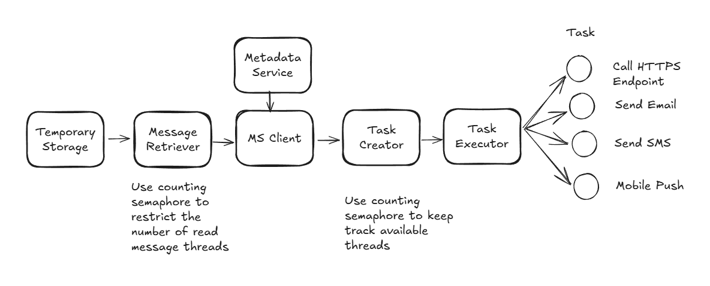

1. Functional Requirements
   1. create topic
   2. public (topicName, message)
   3. subscribe (topicName, endpoint)
2. Non-Functional Requirements
   1. Scalable (support large number of topics, publishers, subscribers)
   2. High Available (survive hardware/network failures)
   3. Low latency
   4. Durable (no lost message, at-least-one delivery)
3. High-level Design  
   Client -> LB -> FrontEnd Service -> Temporary Storage -> Sender -> subscriber A/B  
   FrontEnd Service -> MetadataService -> Metadata DB (topic, subscriptions)
    1. Front End Service
    2. Metadata Service : a caching layer between FrontEnd and Storage. Many read, little writes
      1. Option A: Central Registry
      
      2. Option B: Gossip protocol
      
    3. Temporary Storage
       1. Do we need ACID transactions? NO
       2. Do we need run complex dynamic queries? NO
       3. Do we plan use this for analytics/data warehouse? NO
       4. Do we need it to be easily scale for read and write, and HA and fault torlerance? YES
       5. We need NoSQL
          1. what message limit size? <1MB -> we don't need document store
          2. any relationship between message? NO -> exclude graph type as well
          3. We need Column/Key-value database type
    4. Sender
    