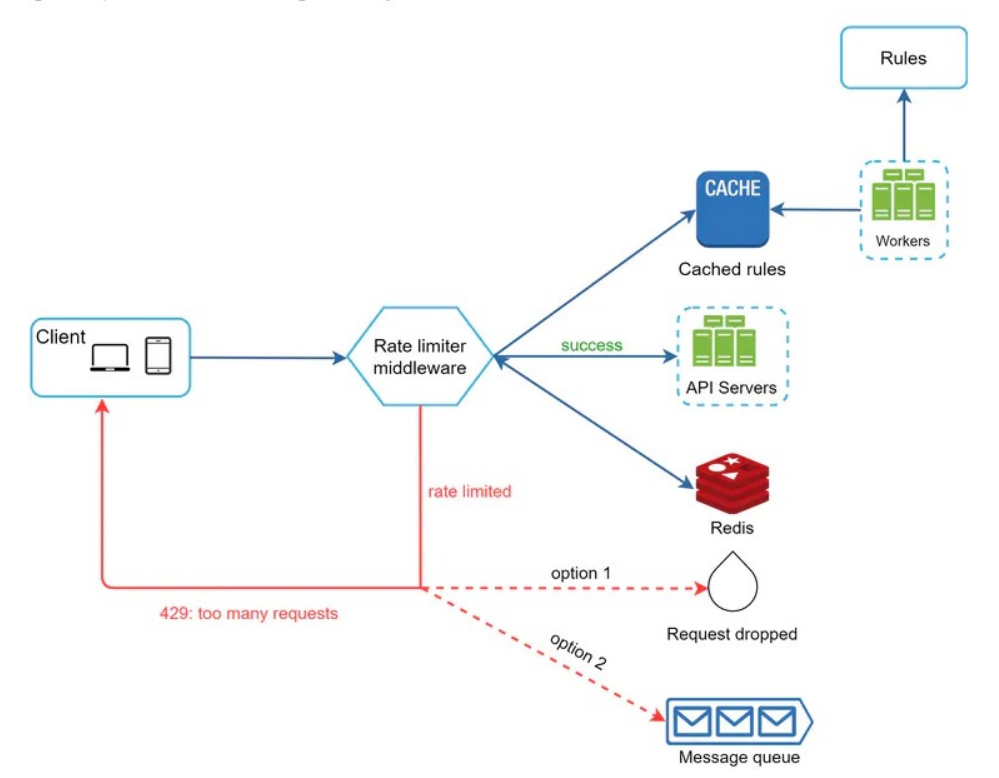

1. Requirements
   1. Accurately limit excessive request
   2. Low latency.(The rate limiter should not slow down response time)
   3. Use as little memory as possible
   4. Distributed rate limiting. (can be shared across multiple servers or process)
   5. Exception handling. (show clear exceptions to users when their requests are throttled)
   6. High fault tolerance. (If there are any problems with the rate limiter, if does not effect the entire system)
2. High-level design
   1. where to put rate limiter? client/server/api gateway
   2. where shall we store counters? Database is slowness of disk access. In-memory cache (like Reids) is a good choice because it is fast and support time-based expiration strategy.
3. Algorithms for rate limiter
   1. Token bucket
   2. Leaking bucket
   3. Fixed window counter
   4. Sliding window log
   5. Sliding window counter
4. Deep Dive
   1. How are rate limiting rules created? Where are the rules stored
   2. How to handle requests that are rate limited?
5. Detailed Design
   1. 
6. Rate limiter in a distributed system
   1. Race condition : Locks are the most obvious solution for solving race condition. However, locks will significantly slow down the system. Two strategies are commonly used to solve the problem: Lua script and sorted sets data structure in Redis.
   2. Synchronization issue: to use centralized data stores like Redis.
7. Performance optimization
   1. Multi-data center is crucial for a rate limiter considering low latency requirements.
8. Monitoring
   1. Gather analytics data to check whether the rate limiter is effective. Primarily, we want to make sure:
      1. The rate limiting algorithm is effective
      2. The rate limiting rule is effective
9. More
   1.  Hard vs Soft rate limitig
   2.  Rate limiting at different levels
   3.  Avoid being rate limited
   4.  Use client cache to avoid making frequent API calls
   5.  Include code to catch exceptions or errors so your client can gracefully recover from exceptions
   6.  Add sufficient back off time to retry logic