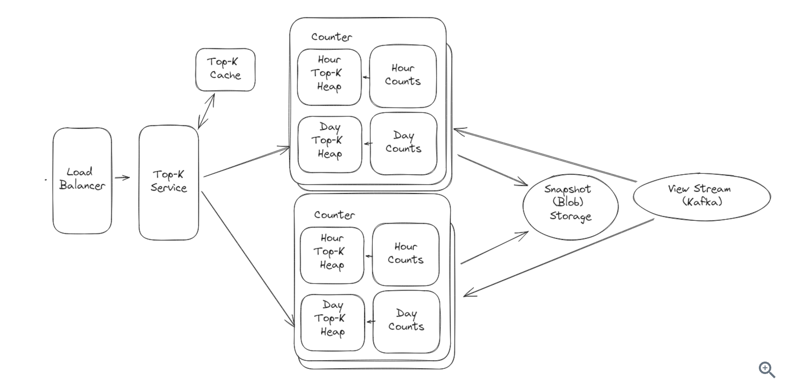

[Ref](https://www.hellointerview.com/learn/system-design/problem-breakdowns/top-k)

1. Functional Requirements
   1. query top K videos (max 1000) for a given time period
   2. Time period is 1 hour/day/month and all-time
   3. (optional) arbitrary time periods
2. Non-Functional Requirements
   1. Tolerate at most 1 min delay when a view occurs
   2. accurate
   3. handle a massive number
   4. low latency
3. Scale Estimation
   1. 70B views/day / (100k seconds/day) = 700k tps
   2. 1M videos/day * 365 * 10 years = 3.6B videos
   3. 4B videos * (8 bytes/ID + 8 bytes/count) = 64GB
4. Core Entity
   1. Video
   2. View
   3. Time Window
5. API
   1. retrieve the top K videos
   ```
   GET /views/top?window={WINDOW}&k={K}
   -> Videos[]
   ```
6. High-level Design
   1. Start with a simple solution for all-time top K videos on a single host.
      1. when a view happen, we increase the view count, and put it into a Top-k heap. -> Client will directly retrieve from heap. -> Challenge: single host cannot afford high throughput, and it would be a single point of failure.
   2. How to maintain reliablility to avoid single point failure?
      1. Relicas with Snapshot -> allow us to scale and recover quickly
   3. How to scale to support the high write throughput?
      1. Elastic partitioning : instead of fixing the paritioning parameters, we can make them variable so we can scale up or down. -> Since our partitions are not fixed, we need to have registry so that each shards know its assignment.
7. Deep Dives
   1. Handle Time Windows: Two pointers
   2. Large Number of incoming requests - High read throughput : cache with TTL
8. Diagram
 
