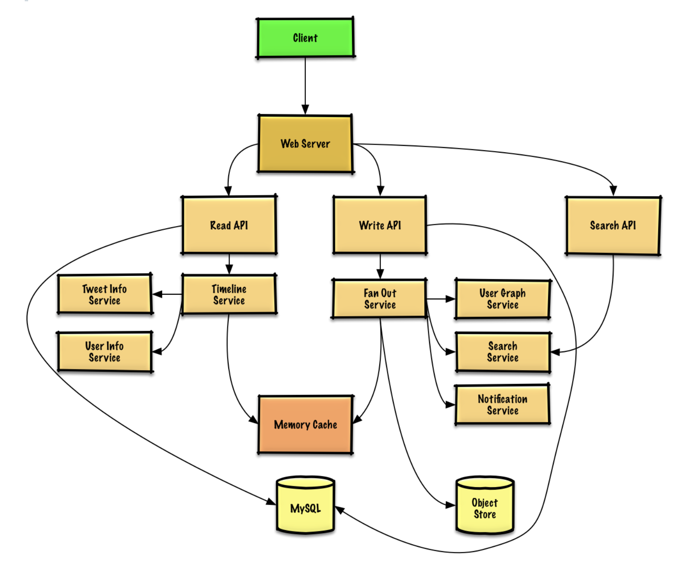
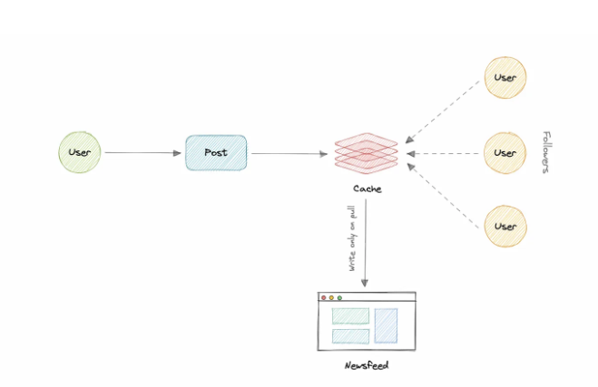
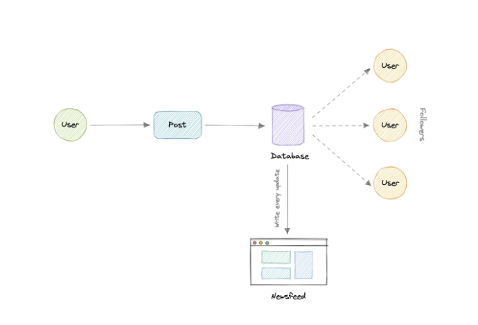
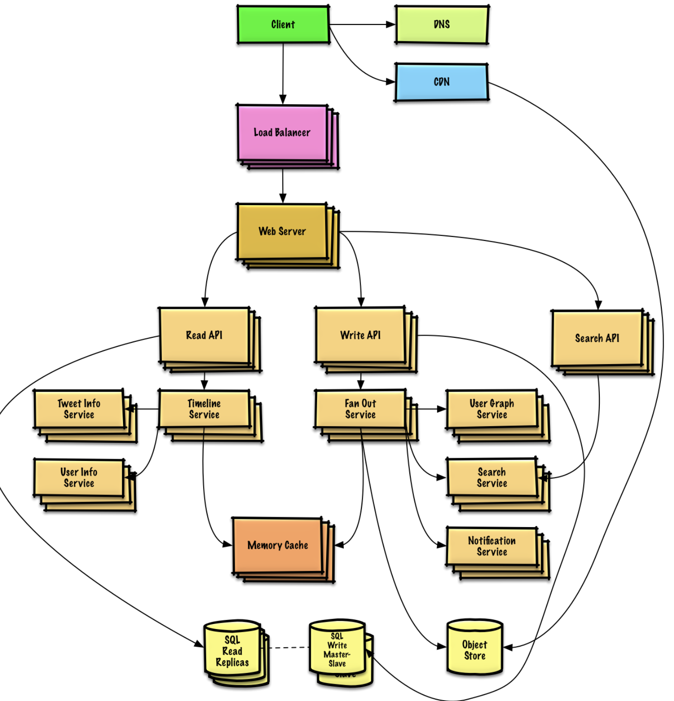

Ref:
* [System-design-primer](https://github.com/donnemartin/system-design-primer/blob/master/solutions/system_design/twitter/README.md)
* [Medium-KaranSingh](https://medium.com/@karan99/system-design-twitter-793ab06c9355)


# Timeline and Search
1. Functional Requirements
   1. Post a tweet
   2. View the user timeline
   3. View the home timeline
   4. Search keyword
2. Non Functional Requirements
   1. HA
   2. Low latency - request should be fast
   3. read heavy then write heavy
   4. ingesting tweets is write heavy
   5. search is ready-heavy
3. Estimation
   1. 100m active users
   2. 500m tweets per day
   3. 250b read requests per month
   4. 10b search per month
4. Data Model
   1. Users: id, email, dob, createdAt
   2. Followers: id, userId, followerId
   3. tweets: id, userId, type, content, createdAt
   4. feeds: id, userId, updatedAt
   
   While our data model seems quite relational, we don't necessarily need to store everything in a single database, as this can limit our scalability and quickly become a bottleneck.
5. High-level design
   1. 
   2. Architecture  
   We will be using Micorservice architecture since it will make it easier to horizontally scale and decouple our services. And each service will have ownership of its own data model.
      1. User Service
      2. Newsfeed Service
      3. Tweet Service
      4. Search Service
      5. Media Service
      6. Notification Service
      7. Analytics Service
6. Design Core Components
   1. Newsfeed
      1. Generation
         1. Retrieve all id that user follows
         2. fetch the relevant tweets based on id
         3. use a ranking algorithm to rank tweets
         4. return the ranked tweets  
         This generation time can take quite a lot of time, especially for users following a lot of people. To improve the performance, the feed can be pre-generated and stored in the cache, then we can have a mechanism to periodically update the feed.
      2. Publishing  
         This can be a quite heavy operation, as a user may have millions followers. To deal with this, we have three different approaches.  
         1. Pull Model (Fan-out on load)  
           
         When a user posts a tweet, the feed is created and stored in memory. The most recent feed is only loaded when user requests it.  
         Pros: reduce write operation on our database  
         Cons: user will not be able to view recent feeds unless they pull the data from the server.  
         2. Push Model (Fan-out on write)  
           
         Once user post a tweet, it is pushed to all follower's feeds immediately.   
         Pros: System doesn't have to go through entire followers list to check for updates  
         Cons: it would increase write operations on the database  
         3. Hybrid Model  
         Combine pull and push mode, provide a balanced approach between two.  
         The hybrid model allows only users with a lesser number of followers to use the push model and for users with a higher number of followers(celebrities), the pull model will be used.  
   2. User posts a tweet
      1. Store user's own tweet to populate the user timeline in a relational database.
         1. NOTE: use case and tradeoff [between choosing SQL and NoSQL](../Database.md#sql-or-nosql)
      2. Deliver tweets and build the home timeline is tricky. Fanning out tweets to all followers (60k per second) will overload a traditional relational database. We'll probably choose a data store with fast writes such as a NoSQL database or Memory Cache. Reading 1 MB sequentially from memory takes about 250 microseconds, while reading from SSD takes 4x and from disk takes 80x longer.
      3. We could store media such as photos or videos on an Object Store.
      4. Steps:
         1. The Client posts a tweet to the Web Server, running as a reverse proxy
         2. The Web Server forwards the request to the Write API server
         3. The Write API stores the tweet in the user's timeline on a SQL database
         4. The Write API contacts the Fan Out Service, which does the following:
            1. Queries the User Graph Service to find the user's followers stored in the Memory Cache
            2. Stores the tweet in the home timeline of the user's followers in a Memory Cache
               1. O(n) operation: 1,000 followers = 1,000 lookups and inserts
            3. Stores the tweet in the Search Index Service to enable fast searching
            4. Stores media in the Object Store
            5. Uses the Notification Service to send out push notifications to followers:
               1. Uses a Queue (not pictured) to asynchronously send out notifications
      5. API
      ```
      $ curl -X POST --data '{ "user_id": "123", "auth_token": "ABC123",  "status": "hello world!", "media_ids": "ABC987" }' https://twitter.com/api/v1/tweet
      ```
      6. For internal communications, we could use Remote Procedure Calls.
   3. User views the home timeline
      1. Steps
         1. The Client posts a home timeline request to the Web Server
         2. The Web Server forwards the request to the Read API server
         3. The Read API server contacts the Timeline Service, which does the following:
            1. Gets the timeline data stored in the Memory Cache, containing tweet ids and user ids - O(1)
            2. Queries the Tweet Info Service with a multiget to obtain additional info about the tweet ids - O(n)
            3. Queries the User Info Service with a multiget to obtain additional info about the user ids - O(n)
      2. API
      ```
      $ curl https://twitter.com/api/v1/home_timeline?user_id=123
      ```
   4. User views the user timeline
      1. Steps
         1. The Client posts a user timeline request to the Web Server
         2. The Web Server forwards the request to the Read API server
         3. The Read API retrieves the user timeline from the SQL Database
   5. Search keywords  
      Here traditional DB are not performed enough, we need something which allow us to store, search, and analyze huge volumes of data in near real-time. Elasticsearch can help us with this use case.  
      1. Steps
         1. The Client sends a search request to the Web Server
         2. The Web Server forwards the request to the Search API server
         3. The Search API contacts the Search Service, which does the following:
            1. Parses/tokenizes the input query, determining what needs to be searched:
               1. Removes markup
               2. Breaks up the text into terms
               3. Fixes typos
               4. Normalizes capitalization
               5. Converts the query to use boolean operation
            2. Queries the Search Cluster (ie Lucene) for the results:
               1. Scatter gathers each server in the cluster to determine if there are any results for the query
               2. Merges, ranks, sorts, and returns the results
      2. API
      ```
      $ curl https://twitter.com/api/v1/search?query=hello+world
      ```
    6. Notification  
       We can use a message queue such as Kafka with the noitification service to dispatch requests.
7. Scale the design
   1. 
   2. Bottleneck 1 - Fanout Service
      1. Celebrity could take several minutes to have their tweets go through the fanout process.
      2. Solutions - We could also avoid fanning out tweets from highly-followed users. Instead, we could search to find tweets for highly-followed users, merge the search results with the user's home timeline results, then re-order the tweets at serve time.
      3. Additional optimizations include:
         1. Keep only several hundred tweets for each home timeline in the Memory Cache
         2. Keep only active users' home timeline info in the Memory Cache
            1. If a user was not previously active in the past 30 days, we could rebuild the timeline from the SQL Database
               1. Query the User Graph Service to determine who the user is following
               2. Get the tweets from the SQL Database and add them to the Memory Cache
         3. Store only a month of tweets in the Tweet Info Service
         4. Store only active users in the User Info Service
         5. The Search Cluster would likely need to keep the tweets in memory to keep latency low
   3. Bottleneck2 - SQL Database
      1. Although the Memory Cache should reduce the load on the database, it is unlikely the SQL Read Replicas alone would be enough to handle the cache misses. We'll probably need to employ additional SQL scaling patterns. The high volume of writes would overwhelm a single SQL Write Master-Slave, also pointing to a need for additional scaling techniques.
         1. Federation
         2. Sharding
            1. To Scale out our database, we need to parition our data. Horizontal parititioning can be a good first step. We can use partitions schema such as:
               1. Hash-based Partition
               2. List-based Partition
               3. Range-based Partition
               4. Composite Partition
            2. The above approaches can still cause uneven data and load distribution, we can solve this using Consistent hashing.
         3. Denormalization
         4. SQL Tuning
      2. We should also consider moving some data to a NoSQL Database.
   4. Some other questions
      1. what if one of our service crashes?
         1. Running multiple instances of each of our services
      2. how do we distribute our traffic between our components?
         1. introducing load balancers between clients, servers, dbs, and cache
      3. how can we reduce the load on our database?
         1. user multiple read replicas for our database
      4. how to improve the availability of our cache?
         1. multiple instances and replicas for our distributed cache
      5. how can we make our notification system more robust?
         1. we can use a dedicated message queue such as Kafka to make our system robust
      6. how can we reduce our media storage costs?
         1. we can add media processing and compression capabilities to compress large files which will save a lot of storage space.


# Search

