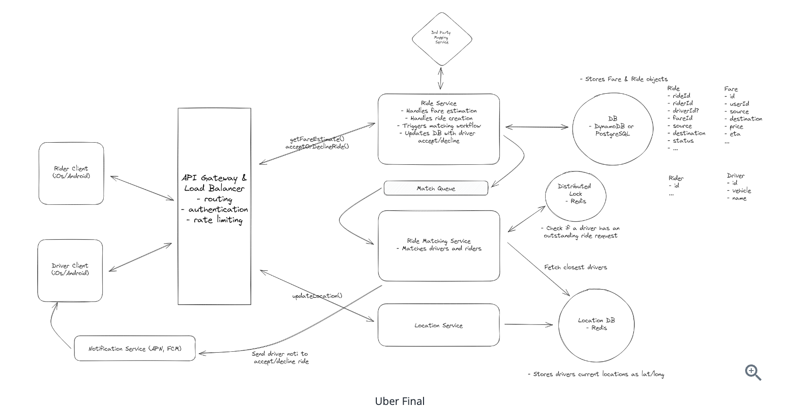

[Ref](https://www.hellointerview.com/learn/system-design/answer-keys/uber)

1. Functional Requirements
   1. Rider input a start location and get estimate fares
   2. Rider request a ride
   3. Rider match with a driver 
   4. Driver accept/decline the request and navigate
   5. (optional) rate
   6. (optional) schedule
   7. (optional) different categories
2. Non-Functional Requirements
   1. HA
   2. low latency matching
   3. strong consistency in ride matching
   4. handle high throughput
   5. (optional) securiy and privacy of data
   6. (optional) robust monitoring, logging and alerting
3. Core Entity
   1. Rider
   2. Driver
   3. Fare
   4. Ride
   5. Location
4. API
   1. get estimate fare
   ```
   GET /fare -> Fare
   {pickupLocation, destination}
   ```
   2. Request ride
   ```
   POST /rides -> Ride
   {fareId}
   ```
   3. Accept ride
   ```
   PATCH /rides/:rideId -> Ride
   {accept/deny}
   ```
   4. Update Location
   ```
   POST /drivers/location -> Success/Error
   {lat, long}
   ```
5. High-level Design
   1. Rider is able to get estimate fare based on start and end location and do request a ride.  
      1. client -> Gateway -> RideService -> DB
   2. Upon request, rider will be matched with a dirver who is nearby and available
      1. RideService -> Ride Matching Service -> DB
      2. client -> Location Service -> DB
   3. Driver will accept/deny a request and navigate to start location
      1. RideMatchingService -> DB (get nearby drivers)
      2. RideMatchingService -> NotificationService -> Driver (ask driver accept/deny) 
6. Deep Dive
   1. How to handle frequent location update and efficient proximity search on location data?
      1. High Write Throughput : Given we have 10 million drivers, sending location every 5 seconds, it's about 2 million updates per second!
      2. Query Efficient : query a table based on lat/long would need a full table scan, which would be extremely inefficient.
      3. To address these two, we can use Redis which supports geospatial data types and commands. -> efficient query and able to handle high volume location write -> also have TTL, allow us to retain only the most recent location.
   2. How to manage system overload from frequent location updates
      1. we can address this by implementing adaptive location update intervals, which dynamically adjust the frequency of location updates based on contextual factors such as speed.
   3. How to prevent multiple ride requests from being sent to the same driver simultaneously?
      1. Based on our non-func requiremetns, we only request one driver at a time for a given rider request AND each driver only receive one ride request at a time. The driver would have 10 seconds to accept/deny before we move on to the next driver. (Same as ticketmaster, the ticket is only sold once while reserving)
         1. Distributed LOCK with TTL
   4. How to ensure no ride requests are dropped during peak time
      1. Queue with Dynamic Scaling
   5. How to scale the system further to reduce latency and improve throughput
      1. Geo-Sharding with Read Replicas
7. Diagram
