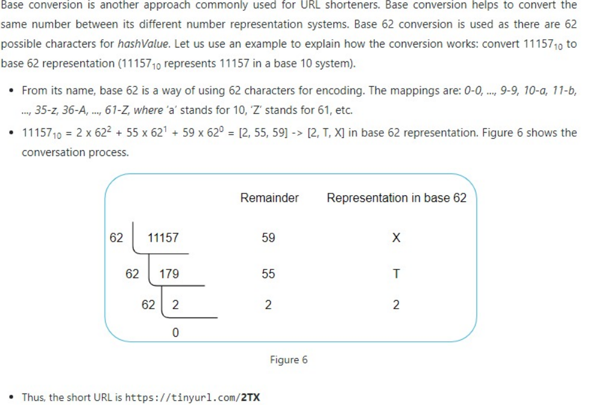

# System Design 1
[REF](https://www.hellointerview.com/learn/system-design/answer-keys/bitly)

1. Functional Requirements
   1. user submit a long url and receive a shorten one
      1. (optional) set expiration time for shorten url
      2. (optional) set custom alias for shorten url
   2. user can access the original url based on the shorten version
   3. (optional) Analytics on link clicks (e.g., click counts, geographic data).
2. Non-Functional Requirements
   1. low latency
   2. high available
   3. shorten url need to be unqiue
   4. support 1B shortened URLs and 100M DAU
   5. (optional) Advanced security features like spam detection and malicious URL filtering.
3. Estimation
   1. read-heavy, 100:1 r/w ratio
   2. Assume 500M urls per month, redirect times will be 500M * 100 = 50B per month -> 20k/s
4. Core Entity
   1. original URL
   2. shorten URL
   3. user
5. API
   1. shorten url
   ```
   POST /urls
   {longUrls, CustomAlias, ExpirationTime}
   -> shortUrls
   ```
   2. Redirect to the original URL
   ```
   GET /{short_url}
   -> HTTP 302 Redirect to the original long URL
   ```
6. High-Level Design
   1. client -> web server (generate short url) -> DB
   2. client -> web server (redirect to the original url)
      1. Temproray redirect 302 vs Permanent redirect 301 :  302 is better
         1. give us more control over the redirection process for update or expire links
         2. prevent browser from cacheing the redirect, which will cause the issue if we need to change or delete short url in the future
         3. allow us to track click statistics for each short url
   3. DB: need to store billions of records, read heady, each object is small, no relationship between record -> NoSQL would be a good choice.
7. Deep Dive
   1. how to ensure short url is unqiue?
      1. increment a global counter and encode it -> easy to scale with proper counter management -> BUT it's challenge to maintain a single global counter
         1. when we try to scale our write service, the counter need to be accesiable for all write instances. -> To resolve this, we can use a centralized Redis instance to store the counter. Redis is single-threaded and is very fast for this use case. It also supports atomic increment operations which allows us to increment the counter without any issues.
         2. optimized method - we can invlove Counter Batch
            1. Each Write Service instance requests a batch of counter values from the Redis instance (e.g., 1000 values at a time).
            2. The Redis instance atomically increments the counter by 1000 and returns the start of the batch
            3. The Write Service instance can then use these 1000 values locally without needing to contact Redis for each new URL
            4. When the batch is exhausted, the Write Service requests a new batch.
   2. how to define short url length?
      1. Assuming 1 billion urls and use base62 encoding, we only need 6 character string.
   3. how to ensure redirect is fast?
      1. add a index of shorten url
      2. implement in-memory cache: store frequently used urls -> for read scalability
      3. Leverage CDN and Edge Computing -> Challenge: complexity and cost
   4. how to support scalability and HA?
      1. each row consist of : shortUrl(8 bytes), longUrl(100bytes),createdAt(8bytes),customAlias(100bytes),expiredAt(8bytes) -> total ~100 bytes, around up to 500 bytes for additional metadata -> store 1b mappings, we need 1B * 500bytes = 500GB storage -> most of db can support it
      2. what if db goes down -> data replication
      3. As our read throughput is much larger than write throughput, we can split primary server into Read Service and Write Service. And horizontally scale each of them.
8. Diagram


# System Design 2
Ref : System Design Interview - An Insider's Guide_ Volume 2

1. Requirements
   1. URL shortening - return a much shorter URL
   2. URL redirecting
   3. High availability, scalability, and fault tolerance considerations
2. Estimiation
   1. Write Operation : 100 millions URLs are generated per day
   2. Write operation per second : 100 million / 24 / 3600 = 1000 per second
   3. Read operation: assuming r/w ratio is 10:1, it will be 10,000 per second
   4. Assuming service will run 10 years, storage will be 100 million * 365 * 10 * 100bytes = 36.5 TB
3. High-level design
   1. API Endpoints
      1. URL shortening: `POST api/v1/data/shorten`
         1. Request parameter: {longURL}
         2. Return short URL
      2. URL redirecting: `GET api/v1/shortURL`
         1. Return long URL for HTTP redirection
   2. URL redirecting [!diagram](../../image/urlshorter1.png)
      1. [301 redirect vs 302 redirect](../SystemDesign.md#http-status)
   3. URL shortening
      1. We must find a hash function fx which satisfy the following requirements
         1. unqiue
         2. can be decoded
4. Deep Dive
   1. Data Model: id, shortURL, long URL
   2. Hash function
      1. Hash value length: 0-9,a-z,A-Z total 62 characters, we need to find the smallest n such that 62^n >= 365 billion -> n is 7.
      2. Hash + collision resolution: Use well known hash functions like CRC32/MD5/SHA-1, collect the first 7 characters of a hash value; recrusively append a new predefined string until no more collision is discovered.
         1. This method can elminate collision; however, it is expensive to query the database to check if a shortURL exists for every request. A technique called bloom filters can improve performance. 
      3. Base 62 conversion 
         1. length is not fixed; collision is not possible; next available shortURL is easy to figure out.
5. Additional Points
   1. Rate limiter
   2. Web server scaling
   3. Databse scaling
   4. Analytics
   5. Availability, consistency, and reliability
