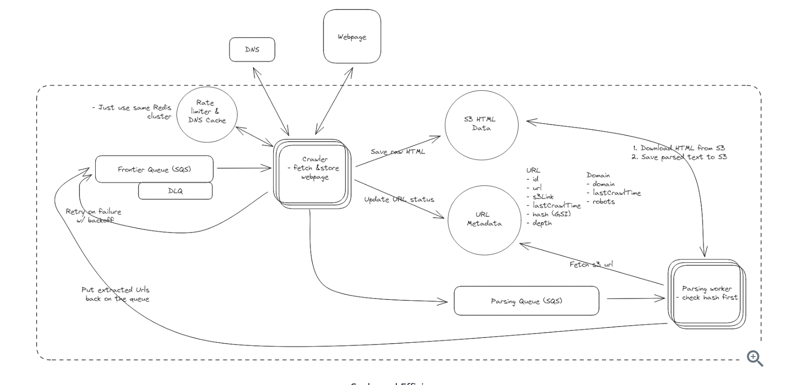

# System Design 1

[Ref](https://www.hellointerview.com/learn/system-design/answer-keys/web-crawler)

1. Functional Requirements
   1. crawl the web from a given seed URLs set
   2. extract text data from the web page and store it
   3. (optional) text data processing
   4. (optional) handling non-text data
   5. (optional) handling dynamic content
   6. (optional) handling authentication
2. Non-Functional Requirements
   1. Consistency, without losing any progress
   2. not overload website
   3. efficiency to crawl the web under 5 days
   4. Scalability to handle 10B pages
   5. (optional) security
   6. (optional) legal requirement and privacy regulations
3. Core Entity
   1. URLs
4. API
   1. Input: Seed URLs 
   2. Output: text data
5. High-level Design
   1. Frontier Queue : have the queue of URLs we need to crawl.
   2. Crawler: fetch web pages, extract text data, extract new URLs to add to the queue
   3. DNS: resolve domain names to IP addresses. (how to cache DNS lookup, handle DNS failures, not overloading DNS servers)
   4. S3: store extracted text data. Choose S3 because it is high scalable and durable.
6. Deep Dives
   1. How to ensure we are fault tolerant and don't lose progress?
      1. Split crawler to smaller stages like URL Fetcher + Text Extraction. Add addtional state to a Metadata DB (dynamo DB).
      2. what about we fail to fetch a URL?
         1. S1: retry in memory -> but what if link is not avaiable anymore or link is down in a long time
         2. S2: Kafka with Manual Exponential Backoff
         3. S3: SQS with Exponentail Backoff: SQS support retries with configurable exponentail backoff out of the box.
      3. what happens if a crawler goes down? we just need to spin up a new one.
         1. Kafka retains messages in a log and does not remove them even after they are read. Crawlers track their progress via offsets, which are not updated in Kafka until the URL is successfully fetched and processed. If a crawler fails, the next one picks up right where the last one left off, ensuring no data is lost.
         2. With SQS, messages remain in the queue until they are explicitly deleted. 
   2. How to ensure politeness and adhere to robots.txt?
      1. robots.txt is a file that website use to communicate with web crawlers. It tells which pages are allowed to crawl and which are not. Also frequency.
      2. We need to repsect robots.txt, and do rate limiting to not overload the website
   3. How to scale to 10B pages and efficiently crawl them in under 5 days?
      1. assuming each page is 2MB. network can handle about 400Gbps. consider we can utilize 30% available bandwidth. there will be (400 / 8 / 2) * 30% = 7500 pages / sec.  -> 10B / 7500 = 15.4 days for a single machine. If we want to finish under 5 days, we need 15.4 / 4 machines = 3.85 days.
      2. DNS: DNS caching and Mulitiple DNS providers
      3. To avoid the scenario that different urls pointing to the same page: 
         1. we can hash the content and store it in the DB. To make sure look up is fast, we need to build an index on the hash column. Challenge: index will be large and may slow down writes.
         2. Bloom Filter: which is a probabilistic data structure that tell whether an element is a member. It can tell us definitively if an element is not in the set, but it can only tell us with some probability if an element is in the set. Redis has a built-in data structure Bloom Filter that we can use.
      4. To avoid crawl the site indefinitely: we can implement a maximum depth of our crawlers.
   4. (optional) How to handle dynamic content?
   5. (optional) How to monitor system health
   6. (optional) How to handle large files? 
   7. (optional) How to handle continual updates?
7. Diagram

# System Design 2
Ref : System Design Interview - An Insider's Guide_ Volume 2