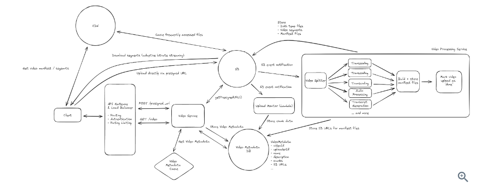

[Ref](https://www.hellointerview.com/learn/system-design/problem-breakdowns/youtube)

1. Functional Requirements
   1. upload videos
   2. watch (stream) videos
   3. (optional) view information about video
   4. (optional) search video
   5. (optional) comment
   6. (optional) see recommend video
   7. (optional) make a channel and manage the channel
   8. (optional) subscribe the channels
2. Non-Functional Requirements
   1. HA
   2. support uploading and streaming large videos(10s of GBs)
   3. low latency for streaming videos
   4. scalable to high number videos (~ 1M videos uploaded/day, 100M videos watched/day)
   5. support resumable uploads
   6. (optional) content protect, protect against bots or fake accounts
   7. (optional) monitoring and alerting
3. Core Entity
   1. user
   2. video
   3. videoMetadata
4. API
   1. upload a vide 
   ```
   POST /upload 
   {Video, VideoMetadata}
   ```
   2. stream a vide 
   ```
   GET /videos/{videoId} 
    -> {Video, VideoMetadata}
   ```
5. High-level Design
   1. Background: Video Streaming
      1. Video Codec : a video codec compresses and decompresses digital video, making it more efficient for storage and transmission.
      2. Video Container: is a file format that stores video data(frames, audio) and metadata.
      3. Bitrate: is the number of bits transmitted over a period of time, typically measured in kilobytes per second (kbps) or mpbs.
      4. Manifest Files: are text-based documents that give details about video streams, inculding 2 types : primary and media files. A primary manifest file lists all the availble versions of a video. Media manifest files list out the links to these clip files and are used by video players to stream video by serving as an index to these segments.
   2. Upload videos: where to store video metadata? Where to store video? what do store for video data?
      1. Assuming upload rate is 1M videos/day
      2. We should consider to store video metadata in a db that can be horizontally partitioned, such as Cassandra. Cassandra offers high availability and enables us to choose a partition key for our data..
      3. For storing video data, we can use a blob storage liek S3 via a presigned URL with multi part upload. Similar like design of Dropbox.
   3. Watch videos: We can use Adaptive bitrate streaming -> relies on having stored segments of videos in different formats. It also relies on a manifest file being created during video upload time, which references all the video segments that are available in different formats. Think of a manifest file as an "index" for all the different video segments with different formats; it will be used by the client to stream segments of video as network conditions vary. Steps are like
      1. client fetch video metadata dn get a presigned URL which point to the manifest file in S3
      2. client download the manifest file
      3. client choose a format based on network condition/user settings. Then retrieve the url for the segment and start to download the first segment
      4. client will play that segment and begin downloading more segments
      5. If the client detect the network condition are slowing/improving, it will vary the format of video segments.
6. Deep Dives
   1. How to handle processing a video to support adaptive bitrate streaming?
      1. Smooth video playback is key for the user experience of this system. In order to support smooth video playback, we need to support adaptive bitrate streaming, so the client can incrementally download segments of videos with varying formats to adapt to fluctuating network conditions. To support such a design, it is important to dig into the details of how video data is processed and stored.
      2. When a video is uploaded in its original format, it needs to be post-processed to make it available as a streamable video to a wide range of devices.The output of this pipeline is:
         1. Video segment files in different formats (codec and container combinations) stored in S3.
         2. Manifest files (a primary manifest file and several media manifest files) stored in S3. The media manifest files will reference segment files in S3.
      3. In order to generate the segments and manifest files, the stepwise order of operations will be:
         1. Split up the original file into segments (using a tool like ffmpeg or similar). These segments will be transcoded (converted from one encoding to another) and used to generated different video containers.
         2. Transcode (convert from one encoding to another) each segment and process other aspects of the segments (audio, transcript generation).
         3. Create manifest files referencing the different segments in different video formats.
         4. Mark the upload as "complete".
   2. how to support resumable uploads? We need to consider how to track process for the video upload flow. Steps are like 
      1. The client would divide the video file into chunks, each with a fingerprint hash. A chunk would be small, ~5-10MB in size.
      2. VideoMetadata would have a field called chunks which would be a list of chunk JSONs, each with fingerprint and status field.
      3. The client would POST request to the backend to update the VideoMetadata with the list of chunks, each with status NotUploaded.
      4. The client would upload each chunk to S3.
      5. S3 would fire S3 event notifications to an AWS Lambda that would update the VideoMetadata by marking the chunk (identified by its fingerprint) as Uploaded.
      6. If the client stopped uploading, it could resume by fetching the VideoMetadata to see the uploaded chunks and to skip chunks that had been uploaded already.
   3. how to scale to a large number of videos uploaded / watched a day?
      1. Video Service: can be horizontally scaled and has a load balancer
      2. Video metadata: stored in Cassandra DB which can be scaled horizontally. Data will be partitioned by videoId. (Could have a hot shard issue)
      3. Video Processing Service: can be horizontally scaled.
      4. S3: S3 scales extremely well to high traffic / high file volumes. It is multi region and can elastically scale.
      5. To address the "hot" video problem(hot shard), we can consider tuning Cassandra to replicate data to a few nodes that can share the burden of storing video metadata. This will mean that several nodes can service queries for video data. Additionally, we can add a cache that will store accessed video metadata. This cache can store popular video metadata to avoid having to query the DB for it. The cache can be distributed, use the least-recently-used (LRU) strategy, and partitioned on videoId as well. The cache would be a faster way to retrieve data for popular videos and would insulate the DB a bit.
      6. To address the streaming issues for users who might be far away from data centers with S3, we can consider employing CDNs. CDNs could cache popular video files (both segments and manifest files) and would be geographically proximate to many users via a network of edge servers. 
7. Diagram
