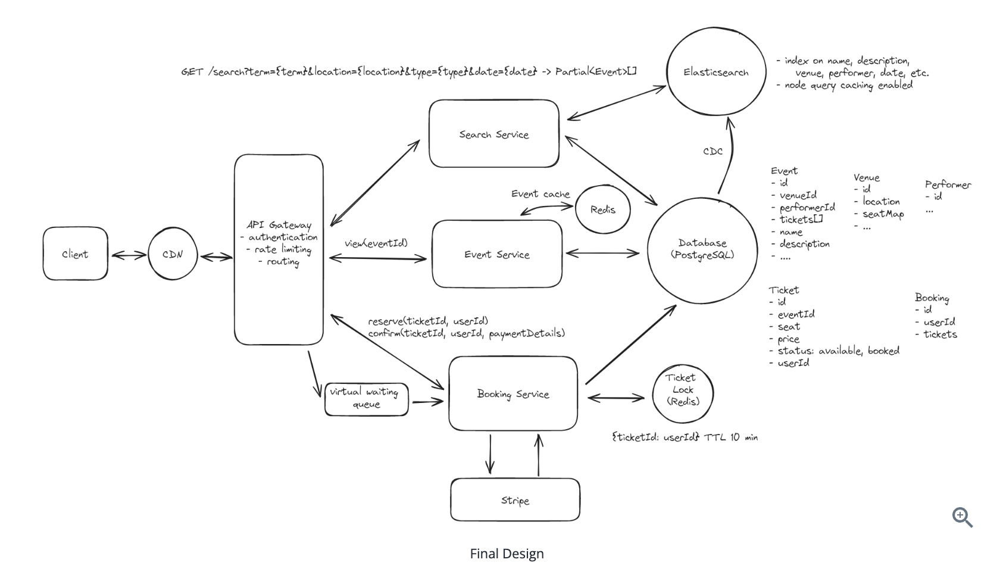

[Ref](https://www.hellointerview.com/learn/system-design/answer-keys/ticketmaster)

1. Functional Requirements
   1. view events
   2. search events
   3. book tickets to event
   4. (optional) cancel event
   5. (optional) add/delete events
   6. (optional) dynamic pricing
2. Non-Functional Requirements
   1. consistency for booking events
   2. scalable, low latency
   3. read heavy, handle high throughput
   4. (optional) fault tolerant
   5. (optional) secure transaction, protect user data
3. Core Entity
   1. Event
   2. User
   3. Performer
   4. Venue
   5. Ticket
   6. Booking
4. API
   1. View events
   ```
   GET /events/{eventId}
   -> Event & Venue & Performer & Ticket[]
   ```
   2. Search event
   ```
   GET /events/search?keyword={keyword}&start={start_date}&end={end_date}&pageSize={page_size}&page={page_number} -> Event[]
   ```
   3. Booking event
   ```
   POST /bookings/{eventId}
   -> bookingId
   {
    ticketIds[],
    paymentDetails,
   }
   ```
5. High Level Design
   1. User should be able to view events  
   client -> API gateway -> event Service -> Database
   2. User should be able to search events  
   client -> API gateway -> search Service -> Database
   3. User should be able to search events  
      1. client -> API gateway -> booking Service -> Database & Third-party payment
      2. We need a database that support transaction (ACID properties)
6. Deep Dive
   1. How do we improve booking experience by reserving tickets?
      1. We need ensure ticket is locked while user is checking out.
      2. Solution 1 : we beign a transaction, and see if ticket is Available, update ticket to Reserved and set expiration to 10 mins, then commit the transaction -> Challenge1: read operation will be slightly slower by filtering on two values, we can involve a compound index -> Challenge2: how to set ticket status back to Available when it's expired, we can utilize a cron job, but still not that effective
      3. Solution 2: we can implement a distributed lock with TTL (time-to-live) like redis. When user select a ticket, acquire a lock using ticketId with a TTL. If user completes the purchase, update ticket status to Booked and release the lock. If ticket is expired, redis will automatically release the lock. -> Challenge1: if lock goes down, user experience will be degraded.
   2. How to scale to support millions concurrent read request during popular events
      1. Caching + Load Balancing + Horizontal Scaling
   3. how to ensure a good user experience during high-demand events with millions booking tickets?
      1. Solution1: use Server-Sent Events (SSE) to push updates to the client in real time to ensure seat map is always up to date. -> Challenge: still not work well for super popular events like Talyor Swift case, available seats will disappear in instant
      2. Solution2: Virtual waiting queue for extremely popular events. It will control the flow of users. When user request booking, they are placed in a virtual queue, we establish a websocket connection. Periodically dequeue users from the queue and notify user via websocket connection that they can proceed to purchase tickets. -> Challenge: There might be a long wait time. To improve user experience, we can keep update queue position and estimated waiting time.
   4. how to improve search to ensure low-latency requirements?
      1. use a full text search engine like Elasticsearch
   5. how to speed up frequently repeated search queries and reduce load on our seach infrastructure
      1. implement query caching and CDN -> Challenge: ensure consistency between cache date and real time data require more effort. And this demands more infrastructure support.
7. Diagram
