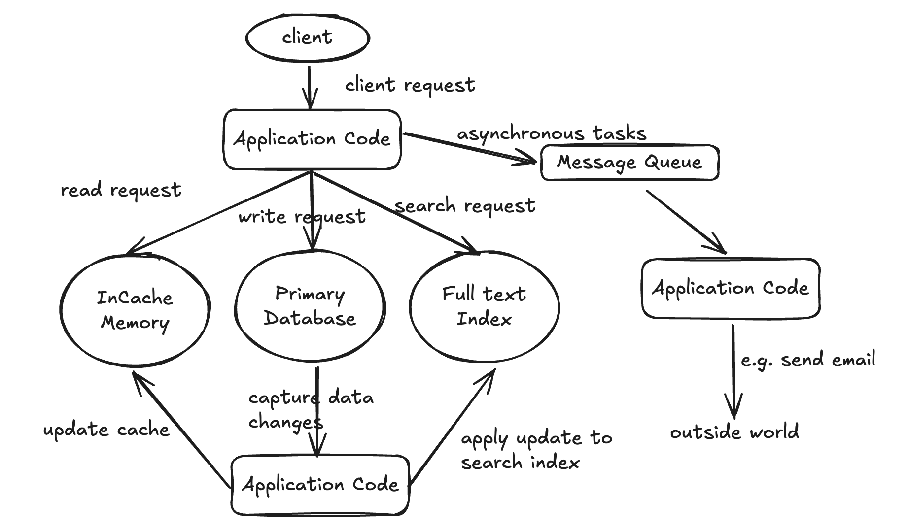

- [System Design](#system-design)
  - [Tutorials](#tutorials)
    - [Interview](#interview)
    - [To be seen](#to-be-seen)
    - [Questions](#questions)
  - [Step-by-step Guide](#step-by-step-guide)
    - [Understand the Basics](#understand-the-basics)
    - [Common System Design Patterns](#common-system-design-patterns)
    - [Books and Resources](#books-and-resources)
    - [Develop a Structured Approach](#develop-a-structured-approach)
  - [How to Design large-scale system](#how-to-design-large-scale-system)
  - [Back-of-the-envelope estimation](#back-of-the-envelope-estimation)
  - [Component](#component)
    - [Non-functional ability:](#non-functional-ability)
    - [Horizontal scaling:](#horizontal-scaling)
    - [Vertical scaling:](#vertical-scaling)
    - [Microservice:](#microservice)
    - [Proxy server:](#proxy-server)
    - [Data Models](#data-models)
    - [PACELC theorem:](#pacelc-theorem)
    - [Redundancy and replication](#redundancy-and-replication)
    - [Storage:](#storage)
    - [Message Queues:](#message-queues)
    - [File Systems:](#file-systems)
    - [System Design patterns:](#system-design-patterns)
    - [API Gateway](#api-gateway)
    - [Communication - TCP/UDP/REST/RPC](#communication---tcpudprestrpc)
    - [Distributed systems:](#distributed-systems)
    - [CDN (Content-delivery-network)](#cdn-content-delivery-network)
    - [Scalable web applications:](#scalable-web-applications)
    - [Heartbeat:](#heartbeat)
    - [AJAX polling vs Long polling vs WebSockets vs Server-Sent Events](#ajax-polling-vs-long-polling-vs-websockets-vs-server-sent-events)
    - [Search](#search)
  - [Data Structure Or Method](#data-structure-or-method)
    - [Quadtree](#quadtree)
    - [Hash and Encode](#hash-and-encode)
    - [Consistent Hashing](#consistent-hashing)
    - [Load Balancer](#load-balancer)
    - [Reverse proxy (web-server)](#reverse-proxy-web-server)
    - [Distributed File System (DFS)](#distributed-file-system-dfs)
  - [Common Issue](#common-issue)
    - [Hot key issue in redis](#hot-key-issue-in-redis)
  - [Interview Guide - Common Questions](#interview-guide---common-questions)
    - [Design Uber](#design-uber)
    - [Design TinyURL (DONE)](#design-tinyurl-done)
    - [Design Instragram (TODO)](#design-instragram-todo)
    - [Design Yelp (TODO)](#design-yelp-todo)
    - [Design Spotify](#design-spotify)
    - [List of common System Design Interview questions](#list-of-common-system-design-interview-questions)

# System Design

System Design is the process of defining the architecture, interfaces, and data for a system that satisfies specific requirements.

## Tutorials
[Done: Education-how-to-prepare-system-design-interview](https://www.educative.io/blog/how-to-prepare-system-design-interview)
[Done: Educative-complete-guide-to-system-design-2023](https://www.educative.io/blog/complete-guide-to-system-design)
[Done: Education-complete-guide-to-system-design-interview-2023](https://www.educative.io/blog/complete-guide-system-design-interview)
[Top 14 System Design interview questions for software engineers](https://www.educative.io/blog/top-10-system-design-interview-questions#chat)
[Top 10 Facebook system design interview questions](https://www.educative.io/blog/facebook-system-design-interview)
[Top 5 distributed system design patterns](https://www.educative.io/blog/distributed-system-design-patterns)

https://github.com/donnemartin/system-design-primer

* TODO:
  * https://github.com/donnemartin/system-design-primer/blob/master/solutions/system_design/twitter/README.md
  * https://github.com/donnemartin/system-design-primer/blob/master/solutions/system_design/scaling_aws/README.md
  * https://github.com/donnemartin/system-design-primer#client-caching

https://github.com/karanpratapsingh/system-design

https://bytebytego.com/courses/system-design-interview/back-of-the-envelope-estimation


### Interview
45-60 min interview
Requirements (functional, non-functional, capacity) - 5 min
Core Entity - 2 min
API - 5 min
Data Flow (optional) - 5 min
High Level Design - 10-15 min
Deep Dive - 10 min

### To be seen
Priority 1:
* Grokking the system design interview
* Youtube: Gaurav Sen
* Youtube: Exponent
* Youtube: Tech Dummies Narendra L
* Youtube: System Design Interview
* Youtube: System Design Fight Club
Priority 2:
* Youtube: Scott Shi
Priority 3:  
* design data intensive system - book
Google Systems Design Interview With An Ex-Googler: Code-deployment system   
https://www.youtube.com/watch?v=q0KGYwNbf-0&t=3135s  
https://www.youtube.com/channel/UCaO6VoaYJv4kS-TQO_M-N_g  
https://www.youtube.com/c/SystemDesignInterview  
https://www.youtube.com/user/tusharroy2525  
https://www.youtube.com/c/TechDummiesNarendraL  
https://www.youtube.com/c/ScottShiCS/playlists  
https://youtu.be/PdtlXdse7pw?feature=shared  
https://www.youtube.com/user/braveheartcy  

https://github.com/donnemartin/system-design-primer

staff prep - https://www.1point3acres.com/bbs/thread-907026-1-1.html

https://www.codinginterview.com

free course  
https://www.educative.io/courses/system-design-interview-handbook/the-system-design-interview
https://github.com/donnemartin/system-design-primer  

https://www.1point3acres.com/bbs/forum.php?mod=viewthread&tid=771667&ctid=231174

二哥java 进阶 concurrent  
https://javabetter.cn/thread/#%E5%B0%8F%E5%86%8C%E5%8C%85%E5%90%AB%E5%93%AA%E4%BA%9B%E5%86%85%E5%AE%B9

### Questions
1. in the PACELC theorm, what means availability, consistency and partition?
2. Cassandra vs Scylla DB
3. Central Registry vs Gossip Protocol
4. Cooridination Service (consensus algorithm)
5. Counting Semaphore

## Step-by-step Guide

### Understand the Basics

Key Concepts:
* Scalability
* Load Balancing
* Caching
* Data Partitioning (Sharding)
* Consistency, Availability, and Partition Tolerance (CAP Theorem)
* SQL vs NoSql Database
* Microservices vs Monolithic Architectures
* Message Queues
* CDNs(Content Delivery Networks)

### Common System Design Patterns

* Client-Server Model
* Master-Slave Model
* Peer-to-Peer Model
* MapReduce
* Pub-Sub Model


### Books and Resources

Books:

* Designing Data-Intensive Applications by Martin Kleppmann
* System Design Interview by Alex Xu
* Building Microservices by Sam Newman

Online Resources:

* Grokking the System Design Interview
* [System Design Primer on GitHub](https://github.com/donnemartin/system-design-primer)

### Develop a Structured Approach

1. Requirements Clarification
   1. Functional requirements(features, user interaction)
      1. who to use
      2. how to use
      3. how many user
      4. what system do
      5. what input and output
      6. how much data
      7. how many request
      8. read/write ratio
   2. Non-functional requirements(scalability, performance, reliability)
2. High-Level Design
   1. Draw an initial high-level diagram
   2. Identify major components and their connections
3. Detailed Design
   1. Drill down into components (eg, database schema, API design)
   2. Consider trade-offs and justify your decisions
4. Scalability Considerations
   1. Address how the system handles increases load
   2. Discuss partitioning, load balancing, and caching strategies
5. Bottlenecks and Trade-offs:
   1. Identify potential bottlenecks
   2. Discuss trade-offs related to CAP theorem, latency vs consistency, etc
6. Security and Maintenance
   1. Consider security aspects(authentication, authorization, data encryption)
   2. Discuss how to maintain and monitor the system


[System Design Template](./systemdesign/system-design-template.md)


## How to Design large-scale system
1. clarify the goals - understand basic requirments
2. determine the scope - describe the feature set and its importance to the end goal
3. design for the right scale 
4. start simple, then iterate - describe the high-level proces end to end
5. consider relavant DSA - decide to use what fundamental data structure and algorithm
6. describe trade-off


## Back-of-the-envelope estimation

| Power	| Approximate | value	| Fulll name |	Short name
| -------|------------|-------|------------|------------
|10	|1 Thousand	|1 Kilobyte	|1 KB
|20	|1 Million	|1 Megabyte	|1 MB
|30	|1 Billion	|1 Gigabyte	|1 GB
|40	|1 Trillion	|1 Terabyte	|1 TB
|50	|1 Quadrillion	|1 Petabyte	|1 PB

ns = nanosecond, us = microsecond, ms=millisecond

Memory access time: ~100 nanoseconds (0.0001 ms)  
SSD access time: ~0.1 milliseconds  
HDD access time: ~10 milliseconds  

Example : Estimate Twitter QPS ans storage requirements  
Assumptions:  
- 300 million monthly active user
- 50% users use Twitter daily
- user post 2 tweets per day on average
- 10% tweets contain media
- data is stored for 5 years

Estimiations:  
- Query per second (QPS)
  - 300 * 50% * 2 tweets / 24 hour / 3600 seconds =~ 3500
  - Peek QPS = 2 * 3500 = 7000
- Media storage
  - Average tweet size : 64 bytes id + 140 bytes text + 1MB media = ~1MB
  - 150 million * 2 * 10% * 1MB =~ 30 TB per day
  - 5 year storage = 30 TB * 365 * 5 = 55 PB

Commonly asked estimation:  
 - QPS, peak QPS
 - Bandwidth and Traffic 
 - storage
 - cache
 - number of server


## Component



### Non-functional ability:
* Reliability
  * Fault tolerance
  * No unauthorized access
  * chaos testing
  * Automating test
  * Staging environment
  * Quick roll-back
* Scalability
  * handle high traffic volume
  * traffic load with peek of read/write
  * Capacity planning
  * Response time vs throughput
  * End user response time
  * Scale up
* Availability: availability is about ensuring the system remains accessible and operational over time
* Maintainability
  * Add new people to work
  * productivity
  * Operable, configurable and testable
  * Simple
  * Evolveable
* Resiliency (the ability to return to normal operations over an acceptable period of time post disruption)
* Redundancy is about building backups and fail-safes into a system
  * Redundancy is a key strategy used to achieve high availability, but availability also depends on other factors, including effective failover mechanisms, maintenance practices, and system architecture.

### Horizontal scaling: 

add more hardware to the existing hardware resource pool. It increases the computational power of the system.

### Vertical scaling: 

add more power to your server. It increases the power of the hardware running the application.

### Microservice: 

structures an application using loosely coupled services.

### Proxy server: 

act as a channel between a user and the internet. (improved security, privacy; access to blocked resources; cache data to speed up request; control of internet usage)

### [Data Models](Database.md)


### PACELC theorem: 

states the following about a system that replicates data  
* if statement: if there's a partition, a distributed system can trade off between availability and consistency. (CAP theorem)  
* else statement: if there's no partition, the system can trade off between latency and consistency.  
* Examples of a PC/EC system include BigTable and HBase. They'll always choose consistency, giving up abailability and lower latency.
* Example of a PA/EL system include Dynamo and Cassandra. They choose availability over consistency when a partition occurs. Otherwise, they choose lower latency.
* Example of PA/EC system include MongoDB, in the case of partition, it chooses availability, but otherwise guarantees consistency.

### Redundancy and replication

### Storage:  
* Block Storage: data is broken down into blocks of equal size, and each block is given a unique identifier for easy accessibility. These blocks are stored in physical storage. As opposed to adhering to a fixed path, blocks can be stored anywhere in the system, making more efficient use of the resources.  

* File Storage: Is a hierarchical storage methodology. The data is store in files. The files are stored in folders. This storage is only good for a limited amount of data, primarily structured data.  

* Object Storage: is designed to handle large amounts of unstructured data. It is the preferred data storage method for data archiving and data backups because it offers dynamic scalability. It isn't directly accessible to an operating system. Communication happens through RESTful APIs at the application level. This type of storage provides immense flexibility and value to systems, because backups, unstructured data, and log files are important to any systems.  

* Redundant Disk Arrays (RAID): Is a technique to use multiple disks in concert to build a faster, bigger, and more reliable disk system.


### Message Queues:  
MQ is a queue that routes messages from a source to a destination, or from sender to the receiver. It follows FIFO policy. MQ facilitate asynchronous behavior, which allows modules to communicate with each other in the background without hindering primary tasks.
* Kafka: Kafka is a distributed system consisting of servers and clients that communicate through a TCP network protocol. The system allows us to read, write, store and process events. Kafka is primarily used for builidng data pipelines and implementing streaming solutions.
    * kafka vs RabbitMQ
    * Kafka vs Kinesis
    * Kafka vs Flink
    * Kafka vs RedisStream


### File Systems:
* Google File System: is a scalable distributed file system designed for large data-intensive applications, like gmail or youtube. It was built to handle batch processing on large data sets and is designed for system-to-system interaction, rather that user-to-user interaction. It's scalable and fault-tolerant.  
* Hadoop [Distributed File System](#distributed-file-system-dfs)(HDFS): is a distributed file system that handles large sets of data and runs on commodity hardware. It was built to store unstructured data. HDFS is a more simplified version of GFS.

### System Design patterns:  
* Bloom filters: Are probabilistic data structures designed to answer the set membership question: Is this element present in the set? Bloom filters are highly space-efficient and do not store actual items. They determine whether an item does not exist in a set or if an item might exist in a set. They can't tell if an item is definitely presently in a set. An empty Bloom filter is a bit vector with all bits set to zero.  
* [Consistent hashing](#consistent-hashing)
* Quorum: is the minimum number of servers on which a distributed operation needs to be performed successfully before declaring the operation's overall success.
  * Sloppy quorum & Hinted Handoff: allows operations to proceed even if only a subset nodes are available
    * if the required nodes for a write quorum are unavailable, the system temporarily writes the data to any available nodes (referred as hinted nodes). Once the node is recovered, hinted nodes will transfer data back to the original node.
    * Similarly, read operations can be satisfied by querying any nodes which hold the relevant data.
    * Pros: Fault tolerance, Improved Latency, Flexibility, Eventual Consistency
    * Cons: Temporary inconsistency, increased complexity, potential of data loss, Resource Overhead, Delay in consistency
* Checksum: It verifies that the data received from the server matches the stored checksum.  
* Merkle trees: Is a binary tree of hashes, in which each internal node is the hash of its two children, and each leaf node is a hash of a portion of the original data. Replicas can contain a lot of data. Splitting up the entire range to calculate checksums for comparison is not very feasible, because there's so much data to be transferred. Merkle trees enable us to easily compare replicas of a range.  
* Leader election: Is the process of designating a single process as the organizer of tasks distributed across several computers. Leader election improves efficiency, simplifies architectures, and reduces operations.  

### API Gateway
It serves as a centralized entry point for managing and routing requests from client to the backend services.  
1. Routing
2. Protocol Translation
3. Request Aggregation
4. Authentication and Authorization
5. Rate limiting and throttling
6. Load Balancing
7. Caching
8. Monitoring and Logging

### Communication - TCP/UDP/REST/RPC
* TCP
* UDP
* REST
* RPC (Remote procedure call): 
  * RPC is request-response protocal:
    * Client program: call the client stub procedure.The parameters are pushed onto the stack like a local procedure call
    * Client stub procedure: Marshals procedure id and arguments into a request message
    * Client communication module: OS sends the message from the client to the server
    * Server communication module: OS passes the incoming packets to the server stub procedure.
    * Server stub procedure: Unmarshalls the results, calls the server procedure matching the procedure id and passes the given arguments
    * The server response repeats the steps above in reverse order.
  * Popular RPC frameworks include Protobuf, Thrift, and Avro
  * RPC is focused on exposing behavior. It is often used for performance reasons with internal communications, 
  * Pros:
    * It works well for internal communication between services, as it provides a more efficient and direct method of invoking functions or methods across networked systems.
    * High Performance or Low Latency, as it often uses binary protocols (like gRPC) rather than text-based formats like JSON or XML used in REST
    * Complex Operations (Batching Calls)
    * gRPC - Strong Typing and Code Generation, Cross language Support
    * Streaming Data (Bidirectional Communication)
  * Cons:
    * While RPC can be more efficient for certain scenarios, REST is often more suitable for web applications, public APIs, and loosely coupled systems. REST is stateless, easy to cache, and uses HTTP, which is universally supported. It’s especially advantageous when building public APIs, as it allows for easy integration with third-party applications and is simpler for developers to interact with, often using tools like curl or Postman.
* REST vs RPC
  * Use RPC when:
    - You need high-performance, low-latency communication.
    - The system involves tightly coupled services or internal communication.
    - You require strong typing and automatic code generation.
    - Streaming or bidirectional communication is important.
    - You're working in a controlled environment with known interfaces.
  * Use REST when:
    - You need a simpler, stateless communication protocol.
    - Your application involves loosely coupled systems, or you are building public APIs.
    - You want to leverage HTTP features such as caching, scalability, and simplicity.
    - You need easy integration with web clients or external consumers.


### Distributed systems: 

Benefits: Scaling, Modular growth, Fault tolerance, Cost-effective, Low latency, Efficiency, Parallelism  
* Distributed system failures: System failure, Communication medium failure, Secondary storage failure, method failure  
* Destributed system fundamental:
    * MapReduce: handle large amounts of data in an efficient manner. Partitioning -> Map -> intermediate files -> Reduce -> Aggregate
    * Stateless and stateful systems: A stateless system maintains no state of past events. Stateful systems are responsible for maintaining and mutating a state.  
    * Raft: establishes the concept of a replicated state machine and the associated replicated log of commands as first-class citizens and supports multiple consecutive rounds of consensus by default. It requires a set of nodes that form a consensus group, or a Raft cluster (Leader, Follower, Candidate)
* Distributed system design patterns: 
    * Object communication: Describe the messaging protocols and permissions for different components of the system to communicate.  
    * Security: Handles confidentiality, integrity, and availability concerns to ensure the system is secure from unauthorized access  
    * Event-driven: Describes the production, detection, consumption, and response to system events.  

### CDN (Content-delivery-network)

A Content Delivery Network (CDN) is a distributed network of servers strategically located across various geographical locations to deliver web content, such as images, videos, and other static assets, more efficiently to users.

* Reduce latency
* improve reliability, availability, scalability, and security of web app.

The primary purpose of a CDN is to reduce latency and improve the overall performance of web applications by serving content from the server nearest to the user. CDNs can also help improve reliability, availability, and security of web applications.

* Flat Topology: In a flat topology, all edge servers in the CDN are directly connected to the origin server. This approach can be effective for smaller CDNs, but may not scale well as the network grows.
* Hierarchical Topology: In a hierarchical topology, edge servers are organized into multiple tiers, with each tier being responsible for serving content to the tier below it. This approach can improve scalability by distributing the load among multiple levels of servers and reducing the number of direct connections to the origin server.
* Mesh Topology: In a mesh topology, edge servers are interconnected, allowing them to share content and load with each other. This approach can enhance the redundancy and fault tolerance of the CDN, as well as improve content delivery performance by reducing the need to fetch content from the origin server.
* Hybrid Topology: A hybrid topology combines elements from various topologies to create an optimized CDN architecture tailored to specific needs. For example, a CDN could use a hierarchical structure for serving static content, while employing a mesh topology for dynamic content delivery.

### Scalable web applications:
* DNS and load balancing  
* N-tier application: are applications that have more than three components involved. (Caches, MQ, Load balancers, Search servers, Components involved in processing large amounts of data, Components running heterogeneous tech like web services)  
* HTTP and REST: HTTP stands for HyperText Transfer Protocol. This protocol dictates the format of messages, how and when messages are sent, appropriate responses, and how messages are interpreted. HTTP messages can be either requests or response. REST stands for Representational State Transfer. It's a ruleset that defines best practices for sharing data between clients and servers, and it emphasizes the scalability of components and the simplicity of interfaces.  
* Stream processing: focus on the real-time processing of continuous streams of data. (Kafka, Storm, Flink)  
* Caching: that you use to temporarily store data so it can be accessed quickly. 
    * Cache eviction: If a cache is full, some data will be evicted. Common policy include FIFO, LIFO, LRU, MRU, LFU, RR
    * Cache memory: According to 80/20 rule (20% data are used 80% time), we can cache 20% of data and improve 80% latency time.

Machine learning and System Design  
Containerization and System Design: Docker and Kubernetes  
The Cloud and System Design:

### Heartbeat: 

A heartbeat message is a mechanism that helps us detect failures in a distributed system.


###  AJAX polling vs Long polling vs WebSockets vs Server-Sent Events

AJAX polling: Polling is a standard technique used by most AJAX apps. The idea is that the client repeatedly polls a server for data.  
1. The client opens a connection and request data from the server using regular HTTP
2. The requested webpage sends request to the server at regular intervlas (eg 0.5s)
3. The server calculates the response and send it back, just like regular HTTP traffic
4. The client repeats the above three steps periodically to get updates from the server.  
Mainly used when no real-time data is needed. One example is the weather app

Long-Polling: The server may not respond immediately - Hanging GET
1. The client opens a connection and request data from the server using regular HTTP, then waits for a response
2. The server delays its response until an update is avilable or a timeout has occurred.
3. When an update is available, the server sends a complete response to the client
4. The client typically sends a new long-poll request, either immediately upon receiving a response or after a pause to allow an acceptable latency period.
5. Each Long-Poll request has a timeout. Therefore, the client has to reconnect periodically after the connection is closed due to timeouts.
Use case : notification system, Live scores, real-time dashboards.

WebSocket:  
It provides a persistent connection between a client and server that both parties can use to start sending data at any time. The WebSocket protocol enables the communication between a client and a server with lower overheads, facilitating real-time data transfer from and to the server.  

Server-Sent Events:  
1. The client opens a connection and request data from the server using regular HTTP
2. The server sends the data to the client whenever there's new information available  
SSE are best when we need real-time traffic from the server to the client or if the server is generating data in a loop and send multiple events to the client.

### Search

Elasticsearch is a powerful search engine that excels in full-text search, complex query execution, and handling high-volume traffic efficiently. At its core, Elasticsearch operates using inverted indexes, a key feature that makes it highly efficient for search operations.  
Inverted indexes allow Elasticsearch to quickly locate and retrieve data by mapping each unique word to the documents or records it appears in, significantly speeding up search queries.


## Data Structure Or Method
### Quadtree
Quadtrees are a knowledge structure that encodes a two-dimensional space into adaptable cells. It's a tree structure where every non-leaf node has four children. During the technique of quadtrees, nodes are recursively divided into pieces, with successive subdivisions leading to smaller and smaller cells.  

When use? Quadtreees are used for scaling an internet service to handle thoudsands of requests every second. This requires an excellent caching strategy. When geolocation is the main parameter of those requests, conventional caching techniques and procedures fall through. Quadtrees are used to understand high cache hit ratios, while also keeping the responses relevant, even in intense areas.

It's a dynamic grid and every night we recompute the quadtree to support out currently subscribed business. If the number of search results entered on a node exceeds a predefined threshold, then we divide it further.
```java
public static void buildQuadtree(Node node) {
    if (searchBusinesses(node).size() > 20) {
        node.subdivide();
        for (Node child : node.getChildren()) {
            buildQuadtree(child);
        }
    }
}
```
When our server receives an invitation for businesses in a location, we first find the quadtree node for that location:
```java
public static void getNearbyBusinesses(float latitude, float longitude) {
    QuadtreeNode node = LookupQuadTreeNode(latitude, longitude);
    String cacheKey = "quadtree_" + node.getId();
    List<Result> results = Cache.get(cacheKey);
    if (results == null) {
        results = searchBusinesses(node);
        Cache.set(cacheKey, results, "2h");
    }
    render(results);
}
```
Quadtrees allow us to mix the advantages of caching the geo-locations with both high and low precisions. 

### Hash and Encode
hash method: MD5 / SHA256  
encode method: base32 / base64  
* How to calcuate url length after hash and encode?
  * The MD5 hash function produces a fixed-size hash value of 128 bits, which is equivalent to 16 bytes or 32 hexadecimal characters. 
  * If you hash a 6-bit URL using MD5, the resulting hash will still be 128 bits in length. It doesn't matter how long or short the input is; MD5 always produces the same size hash.
  * Now, if you encode the 128-bit MD5 hash using Base64, you'll need to calculate the length of the encoded string. Base64 encoding is done in groups of 3 bytes at a time, where each 3 bytes are represented as 4 Base64 characters. If the number of bytes in your hash is not a multiple of 3, padding characters ('=') are added at the end.
  * In the case of a 128-bit hash from MD5, you have 16 bytes. When encoding in Base64:
    - You'll have 16 bytes / 3 bytes per group = 5 groups.
    - Each group is represented as 4 Base64 characters.
    - So, you have 5 groups * 4 characters per group = 20 Base64 characters.
  * However, you also need to consider padding, which is added to make the length a multiple of 4. In this case, you don't need any padding because 20 is already a multiple of 4.
  * So, the encoded URL will be 20 characters long when using Base64 encoding for a 128-bit MD5 hash.
  
### Consistent Hashing
In order to solve the above problem, consistent hashing is used because in this technique on average r/n needs to be remapped, where r is the number of records and n is the number of servers slots. It should be done when:  
* There are a number of servers that need to be scaled up or down depending upon the load.
* There are cache servers that need to be scaled.
* There are many benefits to using consistent hashing:
  * Scalability
  * Load distribution
  * Quick replication and partitioning of data
  * Faster retrieval of keys as each server holds a limited number of keys

The key idea behind consistent hashing is that every record and server is mapped on the unit circle. Each record is then assigned to the first server that appears on the circle in a clockwise direction. This brings even distribution of records.

### Load Balancer
* Round-Robin load balancing: 
The round-robin load balancing technique is the simplest way to distribute traffic across a group of servers. The load balancer forwards the incoming requests to dedicated servers sequentially (one by one mechanism).  
Round-robin is a static load balancer, because it does not modify the state of the servers while distributing incoming traffic.  
Principal: i mod T  
Limitation: This load balancing algorithm is not adaptive, as it does not consider the existing load on servers to distribute incoming requests. Ideally, the load balancer should forward the request to the server whose current state is idle.  
Real-time load balancer: LVS

### Reverse proxy (web-server)
Internet -> proxy -> web server  
A reverse proxy is a web server that centralizes internal services and provides unified interfaces to the public.
* increased security - Hide information about backend servers, blacklist IPs, limit number of connections per client - Clients only see the reverse proxy's IP, allowing you to scale servers or change their configuration
* increased scalability and flexibilty
* SSL termination
* Compression
* Caching
* Static content (like HTML/CSS/JS, Photo, Video)

### Distributed File System (DFS)
A distributed file system (DFS) is a file system that spans across multiple file servers or multiple locations, such as file servers that are situated in different physical places. Files are accessible just as if they were stored locally, from any device and from anywhere on the network.  
A DFS is critical in situations where you need:
* Transparent local access
* location independency
* scalability
* fault tolerance

## Common Issue
### Hot key issue in redis
1. identify hot key
2. choose appropriate data structure
3. client-side caching
4. cache server
5. compresse the value, or store value externally


## Interview Guide - Common Questions
[ref](https://www.educative.io/blog/complete-guide-system-design-interview)  
Three major focus areas in your prep plan should include the **fundamentals of distributed systems, large-scale web application architecture, and how to design distributed systems.**  

### Design Uber
[ref](https://www.educative.io/blog/uber-backend-system-design)
* Problem overview: when designing Uber, there're two kinds of users: drivers and users. Requirements are as follow:  
  * Drivers can frequently notify the service regarding location and availability
  * Users can see all nearby drivers in real-time
  * Users can request a ride using a destination and pick-up time
  * Nearby drivers are notified when a user needs a ride
  * Once a ride is accepted, both the driver and user can see the other’s location for the duration of the trip
  * Once the drive is complete, the driver completes the ride and is available for other users
* Constraints
  * 300 million users and 1 million drivers in the system
  * 1 million active customers and 500 thousand active drivers per day
  * 1 million rides per day
  * All active drivers notify their current location every three seconds
  * System contacts drivers in real-time when a user requests a ride
* Design considerations
  * We need to update data structures to reflect drivers’ locations every three seconds. To update a driver to a new location, we need to find the right grid based on their previous location.
  * If the new position doesn’t belong to the current grid, we need to remove the driver from the grid and reinsert them into the appropriate grid. If the new grid reaches a maximum limit, we have to repartition it.
  * We need a quick mechanism to propagate the current location of nearby drivers to users in the area. Our system needs to notify the driver and the user of the car’s location for the duration of the ride.
* Solving
  * Keeping those considerations in mind, we can determine that a QuadTree isn’t ideal because we can’t guarantee that the tree will update as quickly as our system requires. We can keep the most recent driver position in a hash table and update our QuadTree less frequently. We want to guarantee that a driver’s current location is reflected in the QuadTree within 15 seconds. We’ll call our hash table DriverLocationHT.
  * Driver Location Record
    * DriverId - 3 bytes
    * Old Latitude - 8 bytes
    * Old longitude - 8 bytes
    * New Latitude - 8 bytes
    * New longitude - 8 bytes
      * Total: 1 million * 35 bytes = 35MB
      * Bandwidth: if we get the driverId and location, it will require (3+16=19 bytes). This information is gathered every three sec from 500 thousand daily active drivers, so we will receive 19 * 500,000 = 9.5 MB every three sec.
  * To randomize distribution, we could distribute DriverLocationHT on multiple servers based on the DriverID. This will help with scalability, performance, and fault tolerance. We’ll refer to the machines holding this information as “driver location servers”. These servers will do two more things. Once the server receives an update on a driver’s location, it will broadcast it to relevant users. The server will also notify the respective QuadTree server to refresh the driver’s location.
  * Broadcasting driver locations: we can use a push Model. We can use a notification service and build it on the pub/sub model. User subscribe all updates from nearby drivers. And Each update in a driver's location will be broadcasted to all subscribed users.
    * Assume one million active users and 500 thousand active users per day. Also five customers subscribe to one driver. So we need 3 bytes for driver id and 8 bytes for userId, (500,000*3)+(500,000*5*8)=21.5 MB of memory
    * for bandwidth, for each active driver, we have 5 subscribers, and each driver record is 19 bytes, so we need 5 * 500,000 * 19 bytes = 47.5 MB/s
  * Notification service: we can either use HTTP long polling or push notifications. Users are subscribed to nearby drivers when they open the app for the first time. When new drivers enter their areas, we need to add a new user/driver subscription dynamically. To achieve this, we track the area that a user is watching. However, this can get pretty complicated.
    * To repartition, we can create a cushion so that each grid grows beyond the limit before we decide to partition it. Assume our grids can grow or shrink by an extra 10% before we partition them. This will decrease the load for a grid partition.
* Use case: request ride
  * The customer enters a ride request.
  * One of the Aggregator servers accepts the request and asks the QuadTree servers to return nearby drivers.
  * The Aggregator server collects the results and sorts them by ratings.
  * The Aggregator server sends a notification to the top drivers simultaneously.
  * The first driver to accept will be assigned that ride. The other drivers will receive a cancellation.
  * If the drivers do not respond, the Aggregator will request a ride from the next drivers on our list.
  * The customer is notified once a driver accepts a request.
* Advanced considerations:
  * Fault tolerance and replication
  * Ranking
  * Clients using slow or disconnecting networks
  * Clients that are disconnected during the duration of a ride
  * how to handle billing if a ride is disconnected
  * how to implement machine learning components in your system

### Design TinyURL (DONE)
[ref](https://www.educative.io/blog/system-design-tinyurl-instagram)

### Design Instragram (TODO)
[ref](https://www.educative.io/blog/system-design-tinyurl-instagram)

### Design Yelp (TODO)
[ref](https://www.educative.io/blog/top-10-system-design-interview-questions#proximity)

### Design Spotify
Design Spotify

1. Let me clarify some requirements.

Songs -> Find and play music
Playlist
Users
Artist
Podcast

Which area do you want to focus on for today’s design  -> Use case: Find and play music

Numbers:
1. Song storage: 3MB per song
2. Song metadata: 100 bytes per
3. User metadata: 1KB per

1 billion users
Per use 1 KB -> 10^9 KB = 1TB
100 million songs
Per song 5 MB -> total storage 100 * 10^6 * 5 = 500 TB
3x replication
100B per song metadata

Traffic, how many active users, songs, -> bandwidth

Basic Components

Client -> LB -> WebServer -> DB


### List of common System Design Interview questions
* Design a global chat service like Facebook Messenger or WhatsApp
* Design a social network and message board service like Quora or Reddit
* Design a global file storage and sharing service like Dropbox or Google Drive
* Design a global video streaming service like YouTube or Netflix
* Design an API rate limiter for sites like Firebase or GitHub
* Design a proximity server like Yelp or Nearby Places/Friends
* Design a search engine related service like Type-Ahead
* Design Typeahead Suggestion
* Design Ticketmaster
* Design Twitter
* Design Twitter Search
* Design a Web Crawler
* Design Instagram
* Design FaceBook's Newsfeed
* Design Uber


* Twitter
* Facebook
* Amazon
* YouTube
* Dropbox

* URL Shortener
* Notification System
* E-commerce Platform